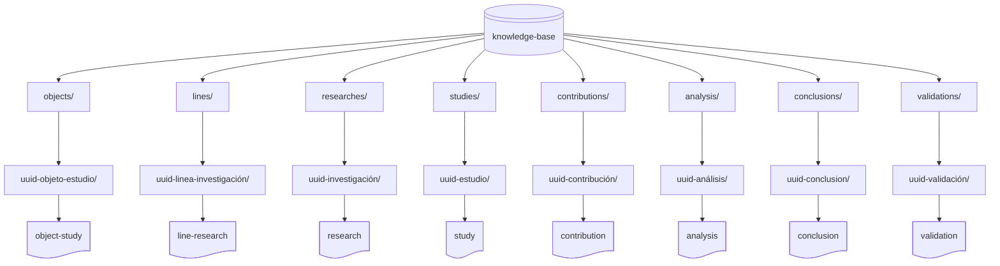

# 🤝 Guía para Contribuir a `cognición`

¡Gracias por tu interés en contribuir a este proyecto!  
`cognición` busca construir y compartir conocimiento de forma **estructurada, ética y colaborativa**. Esta guía te ayudará a sumarte al proceso de forma clara y respetuosa.

> **_¡Gracias por ayudar a construir conocimiento libre, accesible y colaborativo!_**

---

## 📑 Índice

- [📥 Tipos de Contribuciones Bienvenidas](#-tipos-de-contribuciones-bienvenidas)
- [🛠️ Requisitos Previos](#️-requisitos-previos)
- [🚦 Proceso General para Contribuir](#-proceso-general-para-contribuir)
- [👮‍♀️ Buenas Prácticas](#️-buenas-prácticas)
- [📦 Estructura Mínima Esperada](#-estructura-mínima-esperada)
- [🛡️ Código de Conducta](#️-código-de-conducta)
- [🗃️ Recursos Adicionales](#️-recursos-adicionales)
- [🤷‍♀️ ¿Tienes Dudas?](#️-tienes-dudas)

[INDEX]: #-índice
[COGNI]: ./README.md 'cognición'
[LCCBYSA]: ./LICENSE-CC-BY-SA.md 'Licencia CC BY SA'
[LGPL]: ./LICENSE-GPLv3.md 'Licencia GPLv3'
[DOCS]: ./docs/README.md 'Documentación extendida'
[ASAI]: ./ai-assistance/README.md 'Asistente de IA'
[KNOWLEDGEBASE]: ./knowledge-base/README.md 'Base de conocimiento'
[GLOSSG]: ./knowledge-base/glossary.md 'Glosario general'
[AIACG]: ./docs/ai-assistant-configuration-guide.md 'Guía de configuración de asistente de IA'
[PTT]: ./templates/README.md 'Plantillas de trabajo'
[NISS]: https://github.com/issues/assigned 'Nuevo Issue'

💡 **Enlaces de interés:**  
🔗 [`cognición`][COGNI] | [Documentación][DOCS] | [Asistente IA][ASAI]

---

## 📥 Tipos de Contribuciones Bienvenidas

Puedes contribuir de muchas maneras:

- ✍️ Documentando objetos de estudio, líneas de investigación, investigaciones, estudio o contribuciones.
- 🧩 Mejorando plantillas, ejemplos, glosario o estructura general.
- 🧠 Aportando nuevas metodologías, herramientas o recursos conceptuales.
- 🛠️ Corrigiendo errores o actualizando contenidos desactualizados.
- 🤖 Proponiendo mejoras a prompts o automatizaciones.

💡 **Enlaces de interés:**
🔗 [`cognición`][COGNI] | [Documentación][DOCS] | [Asistente IA][ASAI] | [Índice][INDEX]

---

## 🛠️ Requisitos Previos

Antes de contribuir, por favor:

- 📖 Lee el [`README.md`][COGNI] y la [documentación extendida][DOCS].
- 🧭 Comprende el propósito y la estructura de `cognición`.
- 🗂️ Respeta la organización de carpetas y archivos.
- 📘 Consulta el [glosario][GLOSSG] para usar los términos correctamente.

Esto ayuda a mantener **coherencia, claridad y calidad** en todo el proyecto.

💡 **Enlaces de interés:**
🔗 [`cognición`][COGNI] | [Documentación][DOCS] | [Asistente IA][ASAI] | [Índice][INDEX]

---

## 🚦 Proceso General para Contribuir

En este repositorio puedes contribuir de dos formas complementarias:

- A. **Contribuciones investigativas**: objetos de estudio, estudios, líneas, contribuciones analíticas.
- B. **Contribuciones técnicas**: mejoras al código, features, documentación, refactorizaciones, automatizaciones, entre otras.

### 🧪 A. Contribuciones Investigativas

Estas aportaciones enriquecen el contenido, metodología y producción de conocimiento dentro de `cognición`. Puedes:

| Aporte                                                  | ¿Qué haces?                                           | ¿Cómo hacerlo?                                                                                                                                                                                                                                                                   |
| ------------------------------------------------------- | ----------------------------------------------------- | -------------------------------------------------------------------------------------------------------------------------------------------------------------------------------------------------------------------------------------------------------------------------------- |
| 🧠 Crear un nuevo Objeto de Estudio                     | Iniciar un nuevo eje de estudio.                      | Usa el prompt `(crear-objeto)` o crea manualmente `/knowledge-base/objects/[uuid-objeto]/object-study.md`.                                                                                                                                                                       |
| 🏛️ Crear Líneas de Investigación                        | Delimitar rutas específicas dentro del estudio.       | Usa `(crear-línea-investigación)` o crea `/knowledge-base/lines/[uuid-línea]/line-research.md`.                                                                                                                                                                                  |
| 📙 Crear Investigaciones                                | Iniciar un proyecto de investigación.                 | Usa `(crear-investigación)` o crea `/knowledge-base/researches/[uuid-investigación]/research.md`.                                                                                                                                                                                |
| 🔬 Agregar un nuevo Estudio                             | Asociar enfoques, campos o marcos teóricos.           | Usa el prompt `(crear-estudio)` o edita `/knowledge-base/studies/[uuid-estudio]/study.md`.                                                                                                                                                                                       |
| 📥 Documentar una Contribución                          | Añadir contenido crítico, reflexivo, o empírico.      | Usa `(crear-contribución)` o crea `/knowledge-base/contributions/[uuid-contribución]/contribution.md`.                                                                                                                                                                           |
| 🔍Validación/✅Análisis Crítico/💭Conclusion de Aportes | Revisar, validar o ampliar contribuciones existentes. | Usa `(validar-contribución)`, `(analizar-contribución)`, `(conclusión-contribución)` o crea `/knowledge-base/validations/[uuid-validación]/validation.md`, `/knowledge-base/conclusions/[uuid-conclusión]/conclusion.md`, `/knowledge-base/analysis/[uuid-análisis]/analysis.md` |

> 📝 **Nota**: _Estas contribuciones siguen una estructura sistemática basada en plantillas y prompts disponibles en el [asistente IA][ASAI] o en las [plantillas oficiales de trabajo][PTT]_.

### 🛠️ B. Contribuciones Técnicas

Estas mejoras fortalecen la herramienta como proyecto de software libre. Puedes:

| Aporte                     | ¿Qué haces?                                                     | ¿Cómo hacerlo?                                                         |
| -------------------------- | --------------------------------------------------------------- | ---------------------------------------------------------------------- |
| 🚀 Sugerir nuevas features | Proponer funcionalidades útiles para usuarios o investigadores. | Abre un Issue con la etiqueta `feature-request`.                       |
| 🪛 Corregir errores        | Resolver bugs o problemas técnicos.                             | Usa `Pull Request` con referencia al Issue.                            |
| 🧹 Refactorizar código     | Mejorar estructura interna sin alterar comportamiento.          | Indica cambios en `PR` e incluye pruebas si aplica.                    |
| 📝 Mejorar documentación   | Aclarar procesos, agregar ejemplos o corregir errores.          | Puedes editar archivos `.md` directamente o sugerir cambios vía Issue. |
| 🤖 Automatizar procesos    | Añadir scripts, CI/CD, validaciones automáticas.                | Explica impacto y beneficios en la descripción del `PR`.               |

> 📝 **Nota**: _Toda contribución técnica debe pasar por revisión y cumplir con las convenciones del repositorio (formato, estilo, pruebas si aplica)_.

### 📌 ¿Dónde empezar?

- Consulta los Issues etiquetados como "help wanted" (En desarrollo...)
- Lee la [Documentación Extendida][DOCS]
- Explora la [Base de conocimiento][KNOWLEDGEBASE]

**¿Listo para aportar? Abre un [Issue][NISS], usa el Asistente IA o clona el repo y haz magia.**

> 💡 _Participa del diálogo constructivo. Aquí aprendemos en comunidad_.

💡 **Enlaces de interés:**
🔗 [`cognición`][COGNI] | [Documentación][DOCS] | [Asistente IA][ASAI] | [Índice][INDEX]

---

## 👮‍♀️ Buenas Prácticas

- ❌ No edites archivos fuera de tu alcance:  
  Si tienes dudas, consulta primero.
- 🧾 Mantén el formato y sintaxis Markdown:  
  Usa encabezados, tablas y listas donde sea apropiado.
- 🔍 Agrega ejemplos y justificaciones:  
  Toda aportación debe ser comprensible y, si es posible, verificable.
- 🧩 Sigue las licencias del proyecto:
  - **CC BY-SA 4.0** para documentación y plantillas
  - **GPLv3** para código y automatizaciones

💡 **Enlaces de interés:**
🔗 [`cognición`][COGNI] | [Documentación][DOCS] | [Asistente IA][ASAI] | [Índice][INDEX]

---

## 📦 Estructura Mínima Esperada

Las contribuciones deben basarse en las plantillas del repositorio. Un ejemplo típico:

```text
knowledge-base/
├── objects/
|   └── [uuid-objeto-estudio]/
|       └── [nombre-objeto-estudio].md
├── lines/
│   └── [uuid-linea-investigación]/
│       └── [título-línea-investigación].md
├── researches/
│   └── [uuid-investigación]/
│       └── [título-investigación].md
├── studies/
│   └── [uuid-estudio]/
│       └── [título-estudio].md
├── contributions/
│   └── [uuid-contribución]/
│       └── [título-contribución].md
├── analysis/
│   └── [uuid-análisis]/
│       └── [título-análisis].md
├── conclusions/
│   └── [uuid-conclusion]/
│       └── [título-conclusión].md/
├── validations/
|   └── [uuid-validación]/
│       └── [título-validación].md/
└──
```



💡 **Enlaces de interés:**
🔗 [`cognición`][COGNI] | [Documentación][DOCS] | [Asistente IA][ASAI] | [Índice][INDEX]

---

## 🛡️ Código de Conducta

Este es un espacio para compartir, aprender y construir colectivamente.  
No se tolerarán actitudes abusivas, discriminación o ataques personales.  
Todos los aportes deben hacerse con respeto y apertura al diálogo.

💡 **Enlaces de interés:**  
🔗 [`cognición`][COGNI] | [Documentación][DOCS] | [Asistente IA][ASAI] | [Índice][INDEX]

---

## 🗃️ Recursos Adicionales

- [`cognición`][COGNI]
- [Documentación extendida][DOCS]
- [Glosario de general][GLOSSG]
- [Plantillas oficiales de trabajo][PTT]
- [Base de conocimiento][KNOWLEDGEBASE]
- Licencias
  - [CC BY-SA 4.0][LCCBYSA]
  - [GPLv3][LGPL]

💡 **Enlaces de interés:**  
🔗 [`cognición`][COGNI] | [Documentación][DOCS] | [Asistente IA][ASAI] | [Índice][INDEX]

---

## 🤷‍♀️ ¿Tienes Dudas?

Abre un [issue](https://github.com/JesusFuentesGalindo-DataAnalyst/cognicion/issues) o participa en el canal de discusión.

💡 **Enlaces de interés:**  
🔗 [`cognición`][COGNI] | [Documentación][DOCS] | [Asistente IA][ASAI] | [Índice][INDEX]

---
