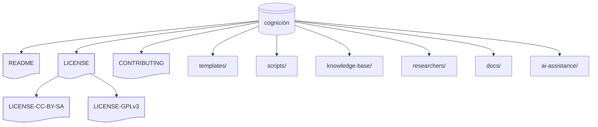

# 🧠 Cognición

_--Conocer con método · Crear con fundamento · Conectar con propósito--_

## 📑 Índice

- [🔍 Conceptos Clave](#-conceptos-clave)
- [📌 Introducción](#-introducción)
- [🎯 Objetivos y Resultados](#-objetivos-y-resultados)
- [🧑‍💻 Público Objetivo](#-público-objetivo)
- [🚀 Guía Rápida para Comenzar](#-guía-rápida-para-comenzar)
- [📦 Estructura del Repositorio](#-estructura-del-repositorio)
- [📌 Usos Sugeridos](#-usos-sugeridos)
- [✨ Estado del Proyecto y Futuros Desarrollos](#-estado-del-proyecto-y-futuros-desarrollos)
- [🔗 Referencias y Recursos](#-referencias-y-recursos)
- [🎯 Conclusión y Beneficios](#-conclusión-y-beneficios)
- [🧭 Principios que Guían el Desarrollo](#-principios-que-guían-el-desarrollo)
- [🔄 Licencias](#-licencias)

<!-- Enlaces de interés -->

[INDEX]: #-índice
[LCCBYSA]: ./LICENSE-CC-BY-SA.md 'Licencia CC BY SA'
[LGPL]: ./LICENSE-GPLv3.md 'Licencia GPLv3'
[DOCS]: ./docs/README.md 'Documentación extendida'
[CONTRIB]: ./CONTRIBUTING.md 'Cómo contribuir'
[ASAI]: ./ai-assistance/README.md 'Asistente de IA'
[PTT]: ./templates/README.md 'Plantillas de trabajo'
[KNOWLEDGEBASE]: ./knowledge-base/README.md 'Base de conocimiento'
[RESEARCHERS]: ./researchers/README.md 'Investigadores'
[AUT]: ./scripts/README.md 'Scripts de automatización'
[ELCON]: ./knowledge-base/objects/3ad176e9-c47e-47b4-9f0b-cc55092cdb88/object-study.md 'Estudio El Conocimiento'
[GLOSSG]: ./knowledge-base/glossary.md 'Glosario general'
[CCGHSM360]: ./docs/ai-assistant-configuration-guide.md#-pasos-para-comenzar-con-github-copilot 'Configurar GitHub Copilot'
[CCMCGPT]: ./docs/ai-assistant-configuration-guide.md#-uso-de-chatgpt 'Configurar ChatGPT'
[CUGH]: https://docs.github.com/es 'Documentación oficial de GitHub'
[CUGHC]: https://docs.github.com/es/copilot/using-github-copilot 'Documentación oficial de GitHub Copilot'
[DOGHS]: https://docs.github.com/es/copilot/using-github-copilot/copilot-spaces 'Documentación de GitHub Copilot Spaces'
[GHCS]: https://github.com/copilot/spaces
[CGPT]: https://chat.openai.com 'ChatGPT'
[DGHC]: https://docs.github.com/es/copilot/using-github-copilot 'Documentación oficial de GitHub Copilot'
[GCGPT]: https://help.openai.com/en/collections/3742473-chatgpt 'Documentación oficial ChatGPT'

<!-- ================= -->

<!-- Conceptos clave (tags) -->

[COGNICION]: ./knowledge-base/glossary.md#cognición
[METODO]: ./knowledge-base/glossary.md#método
[FUNDAMENTO]: ./knowledge-base/glossary.md#fundamento
[PROPOSITO]: ./knowledge-base/glossary.md#propósito
[REPOSITORIO]: ./knowledge-base/glossary.md#repositorio
[ESTRUCTURADA]: ./knowledge-base/glossary.md#estructurado-da
[RIGOR]: ./knowledge-base/glossary.md#rigor
[PARADIGMAS]: ./knowledge-base/glossary.md#paradigma
[PROCESO]: ./knowledge-base/glossary.md#proceso
[DINAMICO]: ./knowledge-base/glossary.md#dinámico-ca
[EVOLUTIVO]: ./knowledge-base/glossary.md#evolutivo-va
[REFINAR]: ./knowledge-base/glossary.md#refinar
[EPISTEMOLOGIA]: ./knowledge-base/glossary.md#epistemología
[SEMANTICO]: ./knowledge-base/glossary.md#semántico-ca
[NODO]: ./knowledge-base/glossary.md#nodo
[VERSIONAR]: ./knowledge-base/glossary.md#versionar
[OBJETIVO]: ./knowledge-base/glossary.md#objetivo

<!-- ================= -->

💡 **Enlaces de interés:**  
🔗 [Documentación][DOCS] | [Cómo contribuir][CONTRIB] | [Asistente IA][ASAI] | [Base de conocimiento][KNOWLEDGEBASE]

---

## 🔍 Conceptos Clave

_[`cognición`][COGNICION]_, _[`método`][METODO]_, _[`fundamento`][FUNDAMENTO]_, _[`propósito`][PROPOSITO]_, _[`repositorio`][REPOSITORIO]_, _[`estructurado`][ESTRUCTURADA]_, _[`rigor`][RIGOR]_, _[`paradigma`][PARADIGMAS]_, _[`proceso`][PROCESO]_, _[`dinámico`][DINAMICO]_, _[`evolutivo`][EVOLUTIVO]_, _[`refinar`][REFINAR]_, _[`epistemología`][EPISTEMOLOGIA]_, _[`semántico`][SEMANTICO]_, _[`nodo`][NODO]_, _[`versionar`][VERSIONAR]_, _[`objetivo`][OBJETIVO]_.

💡 **Enlaces de interés:**  
🔗 [Documentación][DOCS] | [Cómo contribuir][CONTRIB] | [Asistente IA][ASAI] | [Base de conocimiento][KNOWLEDGEBASE] | [Glosario general][GLOSSG] | _[Índice][INDEX]_

---

## 📌 Introducción

¡Bienvenid@! Al repositorio oficial de **`cognición`** 👋  
Este es el lugar donde comienza tu viaje para **crear, organizar y compartir conocimiento** de manera clara, estructurada y con rigor.

**`cognición`** es una herramienta que te acompaña paso a paso para desarrollar investigaciones o proyectos de conocimiento, sin importar si estás empezando o si ya tienes experiencia. Está pensada para jóvenes, docentes, equipos, investigadoras, estudiantes, o simplemente personas curiosas como tú que quieren aprender a investigar de **manera metódica y rigurosa** (en la medida de lo posible).

Con `cognición` puedes:

- 🧠 Elegir cómo quieres pensar tu investigación (existen diferentes formas de conocer, llamadas _paradigmas_).
- ✍️ Seguir una plantilla sencilla que guía tu proceso de principio a fin.
- 🧩 Usar ejemplos, referencias y glosarios que te ayudan a comprender cada paso.
- 🛠️ Guardar y versionar tu trabajo con **Git/GitHub** (Permitiendo que el conocimiento sea dinámico, evolutivo y refinable).
- 🌐 Compartir tu conocimiento con otras personas y conectarlo a una red más grande.

Esta herramienta está diseñada para **asistir en la creación, documentación y validación de investigaciones** a partir de múltiples paradigmas epistemológicos. Esta plataforma combina principios filosóficos, metodológicos y tecnológicos para transformar el acto de conocer en un proceso guiado, colaborativo y estructurado.

> 📝 **Nota**: _Este repositorio no solo contiene el código y lógica de la herramienta, sino también su **fundamento teórico**, su **plantilla base de investigación**, su **glosario de conceptos** y una propuesta de **entrelazado semántico entre investigaciones**_.

### 🔍 ¿En qué se basa?

Esta herramienta no salió de la nada: se construyó a partir de una **investigación real** sobre cómo se crea el conocimiento. Descubrimos que, aunque hay muchas formas de investigar, hay **nueve elementos clave** que siempre están presentes. Esos elementos nos ayudan a gestionar mejor lo que aprendemos, a organizar nuestras ideas y construir conocimiento con sentido.

> 📝 **Nota**: _Si quieres ver la investigación completa que da vida a este proyecto visita_: [El conocimiento][ELCON]

### 🤷‍♀️ ¿Y si no entiendo una palabra?

No te preocupes. En `cognición` usamos un **glosario** para ayudarte con cualquier palabra o concepto que no te resulte claro.  
Un glosario es como un diccionario especial del proyecto, hecho para que nadie se quede atrás.

🔎 **¿Por qué es importante tener un glosario en una investigación?**

Porque cuando investigamos o trabajamos con conocimiento, muchas veces usamos palabras que:

- 🌀 Pueden tener **distintos significados según el contexto**.
- 💬 Son muy técnicas o poco comunes.
- ✍️ Necesitan una **definición precisa para que el trabajo sea claro y coherente**.

Tener un glosario:

- ✅ Evita confusiones.
- ✅ Ayuda a que todos hablen el mismo “idioma”.
- ✅ Hace que tu investigación sea más fácil de entender, compartir y mejorar.

Y lo más importante:

> 💡 _Un buen glosario no es solo para leerlo... también es para construirlo contigo._

> 📝 **Nota**: _Puedes consultar el glosario desde_: [Glosario del Proyecto][GLOSSG]

Si en tu camino descubres una palabra que debería estar allí, ¡puedes sugerirla y ayudar a que el glosario crezca!

### 🧭 ¿Necesitas guía?

En este archivo (`README.md`) se te dará toda la información que necesitas para comenzar, entender cómo está organizado el repositorio, aprender a contribuir, y conocer los principios que hacen que `cognición` sea una herramienta abierta, ética y útil para todos.

Además de este archivo principal, encontrarás otros archivos `README.md` en distintas carpetas del repositorio. Todos tienen el mismo propósito: **ser tu guía dentro de cada sección**, explicando para qué sirve, cómo se usa y qué puedes hacer allí.

> 💡 _Piensa en cada README como una señal en el camino que te ayuda a no perderte, y a aprovechar al máximo todo lo que `cognición` tiene para ofrecerte_.

Así que si alguna vez entras a una carpeta y no sabes por dónde empezar... ¡busca el README! Está hecho para ti.

> 💡 **Recuerda**: **_Aprender a investigar no es solo para expertos. Es una habilidad que cualquiera puede desarrollar... ¡y puede ser incluso divertida!_**

💡 **Enlaces de interés:**  
🔗 [Documentación][DOCS] | [Cómo contribuir][CONTRIB] | [Asistente IA][ASAI] | [Base de conocimiento][KNOWLEDGEBASE] | _[Índice][INDEX]_

---

## 🎯 Objetivos y Resultados

### 🌟 ¿Qué busca lograr `cognición`?

El objetivo principal de `cognición` es ayudarte a **crear, organizar y compartir conocimiento** de forma clara, reflexiva y conectada con otras ideas. No importa si es tu primera vez haciendo una investigación o si ya tienes experiencia: aquí encontrarás un camino guiado, flexible y respetuoso con tu forma de pensar.

### ✅ Objetivos específicos

- 📚 Brindar una **plantilla base** para desarrollar investigaciones o proyectos de conocimiento desde diferentes formas de ver el mundo (paradigmas).
- 🔍 Facilitar la **elección de metodologías y niveles de rigurosidad**, según lo que quieras lograr con tu investigación.
- 🧭 Proporcionar herramientas y ejemplos que te orienten paso a paso, desde la idea inicial hasta el resultado final.
- 🛠️ Integrar tu proceso con **Git y GitHub**, para que puedas guardar tus avances, compartirlos y colaborar con otras personas, así como evolucionar tu investigación.
- 🌐 Construir nodos de conocimiento que puedan **interconectarse y crecer como una red**, creando comunidades de aprendizaje.

### 📈 ¿Qué puedes lograr con esta herramienta?

- ✨ Crear investigaciones bien estructuradas, con fundamentos claros.
- 🔗 Conectar tus ideas con otras investigaciones en curso.
- 🧠 Comprender cómo se construye el conocimiento y qué necesitas para hacerlo con sentido y claridad.
- 🚀 Aprender a trabajar de forma ordenada, versionada y colaborativa.
- 🤝 Participar en una red de personas que también están aprendiendo, investigando y compartiendo lo que saben.

**En pocas palabras**: `cognición` te ayuda a transformar tus ideas en investigaciones reales, bien estructuradas y con impacto.

💡 **Enlaces de interés:**  
🔗 [Documentación][DOCS] | [Cómo contribuir][CONTRIB] | [Asistente IA][ASAI] | [Base de conocimiento][KNOWLEDGEBASE] | _[Índice][INDEX]_

---

## 🧑‍💻 Público Objetivo

`cognición` está pensado para cualquier persona con ganas de **comprender, crear y compartir conocimiento**, sin importar su nivel académico o experiencia previa. Esta herramienta está diseñada para acompañarte en tu camino, ya sea que estés empezando a investigar o que ya tengas proyectos en marcha.

### 👥 ¿A quién puede servirle `cognición`?

- 🎓 **Estudiantes**  
  Que necesitan una guía clara, ordenada y flexible para realizar sus trabajos escolares o universitarios, entendiendo cómo se estructura una investigación y cómo presentar sus ideas con sentido.

- 👩‍🏫 **Educadores y facilitadores**  
  Que buscan herramientas metodológicas para enseñar pensamiento crítico, procesos de investigación y creación de conocimiento de manera más activa, reflexiva y accesible.

- 🌱 **Investigadores comunitarios**  
  Que quieren documentar saberes locales, experiencias colectivas o procesos organizativos **desde su propia perspectiva**, sin tener que seguir lógicas externas o académicas impuestas.

- 🛠️ **Desarrolladores de proyectos sociales o tecnológicos**  
  Que necesitan fundamentar sus propuestas desde el inicio, sistematizar procesos y tomar decisiones basadas en conocimiento bien construido, útil y con propósito.

- 📚 **Personas autodidactas**  
  Que sienten curiosidad por aprender, explorar o transformar su entorno, y que desean hacerlo de forma reflexiva, estructurada y conectada con otras voces y saberes.

> 📝 **Nota**: _Si alguna vez pensaste: “quiero investigar, pero no sé por dónde empezar”…  
> o “tengo una idea importante, pero no sé cómo ordenarla y compartirla”,  
> entonces `cognición` es para ti._

💡 **Enlaces de interés:**  
🔗 [Documentación][DOCS] | [Cómo contribuir][CONTRIB] | [Asistente IA][ASAI] | [Base de conocimiento][KNOWLEDGEBASE] | _[Índice][INDEX]_

---

## 🚀 Guía Rápida para Comenzar

### 🤖 Uso del asistente de IA: GitHub Copilot y ChatGPT

Para aprovechar al máximo la herramienta `cognición`, se ha diseñado un conjunto de **prompts** que permiten un proceso de **llenado asistido, validación guiada y construcción reflexiva**. Estos prompts actúan como instrucciones inteligentes que orientan el comportamiento de la IA, permitiéndole adaptarse a tu proceso mientras desarrollas investigaciones, completas plantillas o redactas documentación de forma estructurada y coherente.

Los prompts de `cognición` están pensados para configurarse en herramientas como **GitHub Copilot** y **ChatGPT**, que ofrecen funcionalidades como el **almacenamiento de contexto** y la **generación de contenido asistido**. Gracias a estas capacidades, la experiencia de investigación se vuelve **más fluida, iterativa y colaborativa**, permitiéndote avanzar con claridad y estructura desde la idea inicial hasta el resultado final.

Existen **dos formas principales de acceder a este acompañamiento directamente desde tu navegador**, sin necesidad de instalar software adicional.

#### 🧪 Opción 1: Usar GitHub Copilot desde un GitHub Space

Puedes trabajar directamente sobre el repositorio de `cognición` utilizando [GitHub Copilot Spaces][DOGHS], una plataforma experimental que te permite crear, editar y ejecutar archivos (Markdown, YAML, notebooks, scripts, etc.) en un entorno interactivo y reproducible, todo desde tu navegador.

Si tienes habilitado [GitHub Copilot][DGHC], funcionará como tu asistente de IA mientras editas tus archivos en el Space. Esto te permitirá:

- Completar campos de plantillas de forma asistida.
- Recibir sugerencias inteligentes y autocompletado en tiempo real.
- Mantener la estructura y coherencia metodológica de tus aportes.
- Ejecutar prototipos o notebooks y compartir tus resultados fácilmente con otras personas.

**¿Qué necesitas?**

- Una cuenta en GitHub.
- GitHub Copilot activado en tu cuenta (recomendado para el llenado asistido).
- Acceso a [GitHub Copilot Spaces][GHCS] (puede requerir acceso beta).

👉 **Guías paso a paso del uso de GitHub:**  
🔗 [Cómo crear un GitHub Space para `cognición`][CCGHSM360]  
🔗 [Cómo usar GitHub][CUGH]  
🔗 [Cómo usar GitHub Copilot][CUGHC]

> 💡 _Trabajar desde un Space con Copilot activo es una de las formas más ágiles y colaborativas de aprovechar el llenado asistido y la asistencia de IA en `cognición`, especialmente para prototipos, documentación interactiva y colaboración._

#### 🧪 Opción 2: Usar ChatGPT desde el navegador

También puedes trabajar con `cognición` utilizando **ChatGPT** desde tu navegador, incluso con una cuenta gratuita.  
Esta opción es ideal si prefieres un entorno conversacional, donde puedas **formular preguntas**, **recibir sugerencias redactadas paso a paso** o **pedir ayuda con la estructura y contenido de tus investigaciones**.

Aunque la versión gratuita no permite mantener una memoria prolongada entre sesiones, sí puedes:

- Dialogar con el asistente de IA sobre una plantilla específica.
- Copiar y pegar fragmentos del repositorio para que te ayude a analizarlos o completarlos.
- Pedir explicaciones sobre conceptos clave del glosario.
- Generar contenido metodológico o estructural guiado.

**¿Qué necesitas?**

- Una cuenta gratuita en [ChatGPT (chat.openai.com)][CGPT].
- Acceso a internet desde un navegador.
- El link al repositorio `cognición` o los fragmentos con los que estás trabajando.

👉 **Guías paso a paso del uso de ChatGPT:**  
🔗 [Cómo colaborar con `cognición` desde ChatGPT][CCMCGPT]  
🔗 [Cómo usar ChatGPT][GCGPT]

> 💡 _ChatGPT funciona mejor si le das **instrucciones claras y fragmentos concretos** de lo que estás haciendo. Puedes trabajar sección por sección y ajustar tus ideas con ayuda del diálogo._

💡 **Enlaces de interés:**  
🔗 [Documentación][DOCS] | [Cómo contribuir][CONTRIB] | [Asistente IA][ASAI] | [Base de conocimiento][KNOWLEDGEBASE] | _[Índice][INDEX]_

---

## 📦 Estructura del Repositorio

```text
cognición/                  # Raíz del repositorio.
├── README.md               # Documento de inicio y guía del repositorio.
├── LICENSE.md              # Licencia múltiple.
├── LICENSE-CC-BY-SA.md     # Licencia de contenido no funcional.
├── LICENSE-GPLv3.md        # Licencia de componentes funcionales.
├── CONTRIBUTING.md         # Métodos de contribución.
├── templates/              # Plantillas de trabajo.
├── scripts/                # Scripts de automatización.
├── knowledge-base/         # Repositorio de nodos de conocimiento.
├── researchers/            # Perfil de investigadores.
├── docs/                   # Documentación de la herramienta.
└── ai-assistance/          # Contenido del asistente de IA.
```



💡 **Enlaces de interés:**  
🔗 [Documentación][DOCS] | [Cómo contribuir][CONTRIB] | [Asistente IA][ASAI] | [Base de conocimiento][KNOWLEDGEBASE] | _[Índice][INDEX]_

---

## 📌 Usos Sugeridos

**En Construcción...**

💡 **Enlaces de interés:**  
🔗 [Documentación][DOCS] | [Cómo contribuir][CONTRIB] | [Asistente IA][ASAI] | [Base de conocimiento][KNOWLEDGEBASE] | _[Índice][INDEX]_

---

## ✨ Estado del Proyecto y Futuros Desarrollos

**En Construcción...**

💡 **Enlaces de interés:**  
🔗 [Documentación][DOCS] | [Cómo contribuir][CONTRIB] | [Asistente IA][ASAI] | [Base de conocimiento][KNOWLEDGEBASE] | _[Índice][INDEX]_

---

## 🔗 Referencias y Recursos

- [Documentación][DOCS]
- [Cómo contribuir][CONTRIB]
- [Asistente IA][ASAI]
- [Plantillas oficiales de trabajo][PTT]
- [Automatización][AUT]
- [Base de conocimiento][KNOWLEDGEBASE]
- [Investigadores][RESEARCHERS]
- [Glosario][GLOSSG]

💡 **Enlaces de interés:**  
🔗 [Documentación][DOCS] | [Cómo contribuir][CONTRIB] | [Asistente IA][ASAI] | [Base de conocimiento][KNOWLEDGEBASE] | _[Índice][INDEX]_

---

## 🎯 Conclusión y Beneficios

**En Construcción...**

💡 **Enlaces de interés:**  
🔗 [Documentación][DOCS] | [Cómo contribuir][CONTRIB] | [Asistente IA][ASAI] | [Base de conocimiento][KNOWLEDGEBASE] | _[Índice][INDEX]_

---

## 🧭 Principios que Guían el Desarrollo

> 💡 Desarrollo de herramientas que liberen tiempo para el pensamiento, la creación y la organización colectiva.

| Principio                    | Descripción                               |
| ---------------------------- | ----------------------------------------- |
| ✔ Alfabetización estratégica | El software debe educar mientras se usa.  |
| ✔ Acceso universal           | La accesibilidad es justicia tecnológica. |
| ✔ Transparencia y confianza  | Se documenta y comparte abiertamente.     |

> 📝 **Nota**: Para más información sobre los principios y filosofía: **[(JFG) {AAA_Software} : Principios y filosofía](https://github.com/JesusFuentesGalindo#-principios-y-filosof%C3%ADa)**

💡 **Enlaces de interés:**  
🔗 [Documentación][DOCS] | [Cómo contribuir][CONTRIB] | [Asistente IA][ASAI] | [Base de conocimiento][KNOWLEDGEBASE] | _[Índice][INDEX]_

---

## 🔄 Licencias

Este repositorio usa una estructura de licencias múltiples según el tipo de contenido:

- 📚 **Documentación, plantillas y material metodológico**
  Licencia: [Creative Commons Attribution-ShareAlike 4.0 International (CC BY-SA 4.0)][LCCBYSA]  
  Esto incluye: el marco teórico, glosario, plantillas de investigación, contenidos educativos y `README.md`.

- 💻 **Código fuente, scripts y herramientas automatizadas**
  Licencia: [GPLv3 License][LGPL]  
  Esto incluye: cualquier archivo `.js`, `.py`, `.sh`, (sin limitarse a los mismos) y la lógica programática de la herramienta.

> 💡 _Al contribuir a este repositorio, aceptas que tu aportación quede bajo la licencia correspondiente según el tipo de contenido_.

💡 **Enlaces de interés:**  
🔗 [Documentación][DOCS] | [Cómo contribuir][CONTRIB] | [Asistente IA][ASAI] | [Base de conocimiento][KNOWLEDGEBASE] | _[Índice][INDEX]_

---
