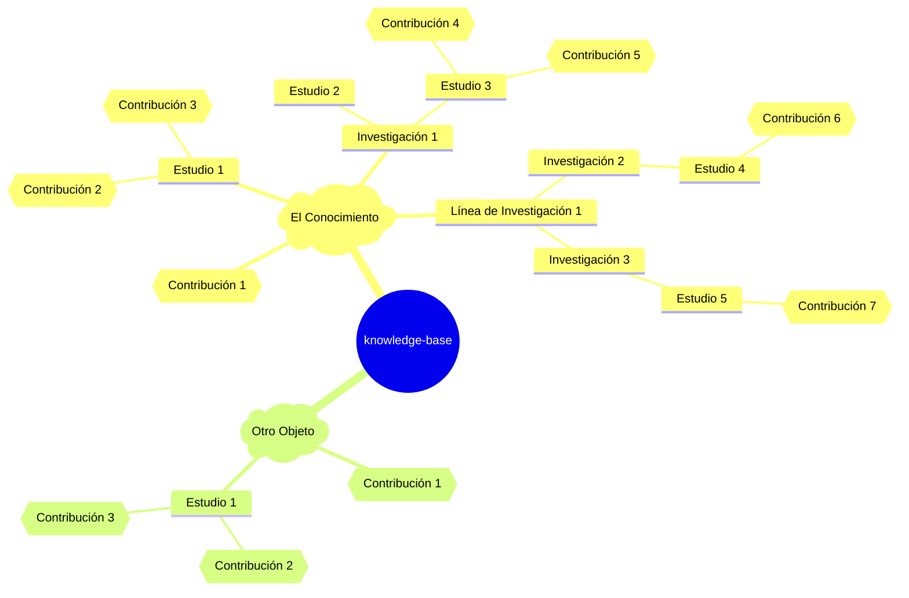

# 🧠 Fundamento Teórico del Objeto de Estudio

Este documento presenta una síntesis teórica del **Objeto de Estudio** en el marco metodológico de `cognición`, articulando su definición, propiedades y función estructurante dentro del proceso de `cognición`.

---

## 📑 Índice

- [🔍 Conceptos Clave](#-conceptos-clave)
- [📌 Definición General](#-definición-general)
- [🧩 Propiedades Fundamentales](#-propiedades-fundamentales)
- [🚦 Estados Evolutivos del Objeto de Estudio](#-estados-evolutivos-del-objeto-de-estudio)
- [🎭 Rol dentro de `cognición`](#-rol-dentro-de-cognición)
- [🧬 Estructura Semántica](#-estructura-semántica)

<!-- Enlaces de interés -->

[INDEX]: #-índice 'Índice'
[COGNI]: ../../README.md 'cognición'
[INI]: ../../knowledge-base/README.md 'Conocimiento Base'
[GLOSSG]: ../../knowledge-base/glossary.md 'Glosario general'
[DOCS]: ../README.md

<!-- ================= -->

<!-- Conceptos clave (tags) -->

[COGNICION]: ../../knowledge-base/glossary.md#cognición
[FUNDAMENTO]: ../../knowledge-base/glossary.md#fundamento
[TEORIA]: ../../knowledge-base/glossary.md#teoría
[SINTESIS]: ../../knowledge-base/glossary.md#síntesis
[NODO]: ../../knowledge-base/glossary.md#nodo
[OBJETIVO]: ../../knowledge-base/glossary.md#objetivo
[DINAMICO]: ../../knowledge-base/glossary.md#dinámico-ca
[EVOLUTIVO]: ../../knowledge-base/glossary.md#evolutivo-va
[REFINAR]: ../../knowledge-base/glossary.md#refinar
[SEMANTICO]: ../../knowledge-base/glossary.md#semántico-ca
[CATALIZADOR]: ../../knowledge-base/glossary.md#catalizador-ra
[CONVERGENCIA]: ../../knowledge-base/glossary.md#convergencia
[HOLISTICO]: ../../knowledge-base/glossary.md#holístico
[MUTABLE]: ../../knowledge-base/objects/3ad176e9-c47e-47b4-9f0b-cc55092cdb88/glossary.md#mutable

<!-- ================= -->

💡 **Enlaces de interés:**  
🔗 [`cognición`][COGNI] | [Documentación][DOCS] | [Inicio][INI] | [Glosario general][GLOSSG]

---

## 🔍 Conceptos Clave

_[`cognición`][COGNICION]_, _[`fundamento`][FUNDAMENTO]_, _[`teoría`][TEORIA]_, _[`síntesis`][SINTESIS]_, _[`objetivo`][OBJETIVO]_, _[`dinámico`][DINAMICO]_, _[`evolutivo`][EVOLUTIVO]_, _[`refinar`][REFINAR]_, _[`mutable`][MUTABLE]_, _[`nodo`][NODO]_, _[`semántico`][SEMANTICO]_, _[`catalizador`][CATALIZADOR]_, _[`convergencia`][CONVERGENCIA]_, _[`holístico`][HOLISTICO]_.

💡 **Enlaces de interés:**  
🔗 [`cognición`][COGNI] | [Documentación][DOCS] | [Inicio][INI] | [Glosario general][GLOSSG] | _[Índice][INDEX]_

---

## 📌 Definición General

El **Objeto de Estudio** es el **fenómeno, entidad o concepto principal** sobre el cual se dirige el proceso de `cognición`. Es el **"qué"** de toda actividad de estudio y representa una unidad estructural universal que conecta teoría, práctica y exploración.

💡 **Enlaces de interés:**  
🔗 [`cognición`][COGNI] | [Documentación][DOCS] | [Inicio][INI] | [Glosario general][GLOSSG] | _[Índice][INDEX]_

---

## 🧩 Propiedades Fundamentales

- 🎯 **Es de naturaleza objetiva:** busca representar el fenómeno tal como es concebido o percibido, más allá del sujeto. Es decir, representa la realidad tal cual es percibida o concebida de manera independiente del sujeto. **Busca** ser una representación fiel y sin sesgos iniciales del fenómeno que se quiere comprender.
- 🔄 **Es dinámico, evolutivo y refinable:** cambia con el tiempo a medida que se producen nuevos estudios y hallazgos. A medida que las investigaciones y estudios producen nuevas contribuciones, el objeto de estudio se redefine, amplía o refina. Su comprensión no es estática; crece y se transforma con cada nueva contribución.
- 🧶 **Es multifacético:** posee múltiples dimensiones que pueden ser abordadas desde diversas líneas de investigación o enfoques. No se limita a un solo tipo de información, sino que abarca la riqueza de datos, teorías, conceptos y descubrimientos que surgen de la exploración del fenómeno, sin importar la perspectiva.
- 🧠 **Es catalizador de líneas de investigación:** funciona como punto de partida para construir paradigmas o enfoques diversos. Actúa como el **catalizador universal** para la generación de conocimiento. Su existencia impulsa a los **sujetos cognoscentes** a formular diversas **líneas investigativas** (paradigmas o enfoques) para explorarlo desde múltiples ángulos. Es el punto de referencia común que distintas perspectivas eligen para sus exploraciones.
- 🧭 **Sirve como eje integrador:** permite entrelazar diferentes perspectivas y resultados en torno a un mismo foco de análisis. Aunque las **líneas de investigación** puedan abordarlo desde diferentes paradigmas, el objeto de estudio sigue siendo el **punto de convergencia** que permite comparar, contrastar e integrar los hallazgos obtenidos desde diversas perspectivas, contribuyendo a una comprensión más holística del fenómeno.
- 🧪 **Puede ser empírico, abstracto o conceptual:** su naturaleza no está limitada a lo observable. Es decir, no se limita a entidades físicas observables. Puede ser un fenómeno natural, un constructo social, una teoría, un concepto filosófico, un sistema o incluso una experiencia subjetiva, siempre y cuando sea el foco de conocimiento.
- ✂️ **Permite la delimitación:** aunque amplio, es acotable para fines operativos o metodológicos. Es decir, aunque es amplio en su concepción, su naturaleza permite que se establezcan límites para que las investigaciones y estudios específicos puedan enfocarse en aspectos manejables, sin perder la conexión con el todo.
- ⚫ **Es mutable:** su comprensión y definición pueden cambiar con base en nuevos aportes, reflexiones o paradigmas. En consonancia con su naturaleza dinámica, evolutiva y refinable, el **objeto de estudio no es estático**. Puede **cambiar o transformarse** en cómo lo definimos, entendemos o incluso percibimos a medida que el proceso de `cognición` avanza y se descubren nuevas realidades o se adoptan nuevas perspectivas sobre él.

💡 **Enlaces de interés:**  
🔗 [`cognición`][COGNI] | [Documentación][DOCS] | [Inicio][INI] | [Glosario general][GLOSSG] | _[Índice][INDEX]_

---

## 🚦 Estados Evolutivos del Objeto de Estudio

| Estado           | Descripción breve                                                        |
| ---------------- | ------------------------------------------------------------------------ |
| ⚫ Borrador      | Idea inicial sin desarrollo formal aún.                                  |
| ⚪ Nuevo         | Identificado, en fase de exploración inicial.                            |
| 🟡 En desarrollo | Activo, con estudios o investigaciones en curso y nuevas contribuciones. |
| 🟢 Maduro        | Comprensión consolidada, con baja actividad reciente.                    |
| 🔵 Refinado      | Objeto redefinido tras hallazgos significativos.                         |
| 🔴 Obsoleto      | Reemplazado o abandonado en favor de otro objeto.                        |

### 🔠 Escenarios para el Estatus del Objeto de Estudio

Los colores representan el "estado de madurez" o el nivel de actividad y refinamiento en la comprensión del **Objeto de Estudio**.

- **⚫ Borrador (Propuesta / Idea Inicial)**
  - **Escenario:** El objeto de estudio es una **idea, un concepto o un fenómeno propuesto** que está siendo evaluado para su posible inclusión en el marco de conocimiento. Su definición es tentativa, sus límites son difusos y aún no se ha comprometido ningún esfuerzo de investigación formal o estructurado. Puede ser una idea que se está madurando internamente antes de pasar a una exploración más activa, se realizan las primeras contribuciones sin necesario rigor metodológico.
  - **Indicador Clave:** Existencia de una descripción mínima, quizás algunas preguntas preliminares, pero sin investigaciones o estudios activos asociados. Puede estar en revisión por el sujeto cognoscente o un grupo.

* **⚪ Nuevo (Exploración Inicial)**

  - **Escenario:** El objeto de estudio ha sido **identificado o propuesto recientemente**. Es un área de interés emergente sobre la cual se tiene una comprensión inicial o rudimentaria. Se están formulando las primeras preguntas, se están realizando las primeras búsquedas bibliográficas exploratorias, y las líneas investigativas específicas para abordarlo están en fase de definición o debate.
  - **Indicador Clave:** Pocos o ningún estudio o investigación formal asociados todavía, o las primeras contribuciones son muy preliminares y comienza a seguir una metodología.

* **🟡 En Desarrollo (Investigaciones Activas)**

  - **Escenario:** El objeto de estudio es el **foco de una o varias líneas investigativas**, **investigaciones** o **estudios** activos. Se están llevando a cabo múltiples investigaciones y estudios, generando nuevas contribuciones de forma regular. La comprensión del objeto está en constante expansión y se están revelando nuevas facetas, propiedades o relaciones. Hay un dinamismo constante en su exploración.
  - **Indicador Clave:** Gran actividad de `commits` y `pull requests` en los nodos de conocimiento relacionados con este objeto, se ha adoptado una o multiples metodologías y paradigmas.

* **🟢 Maduro (Comprensión Sólida, Pocas Nuevas Investigaciones)**

  - **Escenario:** Se ha alcanzado un **nivel de comprensión robusto y consolidado** sobre el objeto de estudio a través de diversas **herramientas cognitivas**. Se han respondido la mayoría de las preguntas iniciales, las teorías están bien establecidas, y las contribuciones principales ya se han generado. La actividad de nuevos estudios sobre este objeto ha disminuido, aunque puede haber refinamientos menores o aplicaciones.
  - **Indicador Clave:** Pocas contribuciones o estudios nuevos, pero un cuerpo de conocimiento existente bien desarrollado y referenciado.

* **🔵 Refinado (Ajustado por Hallazgos Clave)**

  - **Escenario:** Similar a "Maduro", pero con una distinción importante: el objeto ha pasado por un **proceso significativo de revisión, ajuste o redefinición** debido a **hallazgos cruciales** o **nuevas perspectivas** que cambiaron sustancialmente la comprensión previa. Este estatus implica que se ha alcanzado una versión "mejorada" o más precisa del objeto, o que se ha integrado una visión más compleja a partir de la retroalimentación de las contribuciones.
  - **Indicador Clave:** Una actualización notable en la "Introducción" o el "Marco Teórico de Referencia" del objeto, que refleja un cambio cualitativo en su conceptualización. Puede ser el resultado de un "refinamiento" significativo.

* **🔴 Obsoleto (Reemplazado por Nuevo Objeto)**
  - **Escenario:** El objeto de estudio, tal como fue definido inicialmente, ha sido **reemplazado o desestimado** por un nuevo objeto de estudio o por una conceptualización radicalmente diferente. Esto puede ocurrir porque los hallazgos demostraron que el objeto original no era válido, o porque se encontró una forma mucho más eficaz o fundamental de entender el fenómeno. Es un "cierre" para ese objeto específico, aunque su historial y contribuciones puedan permanecer para referencia.
  - **Indicador Clave:** No se esperan más estudios o investigaciones sobre este objeto; se recomienda referirse a un nuevo objeto o a una redefinición drástica.

**Orden Lógico Propuesto para los Estatus:**

`⚫ Borrador` → `⚪ Nuevo` → `🟡 En Desarrollo` → `🟢 Maduro` / `🔵 Refinado` → (Potencialmente) `🔴 Obsoleto`

💡 **Enlaces de interés:**  
🔗 [`cognición`][COGNI] | [Documentación][DOCS] | [Inicio][INI] | [Glosario general][GLOSSG] | _[Índice][INDEX]_

---

## 🎭 Rol dentro de `cognición`

- 🧱 Es el **núcleo estructural** de la jerarquía de nodos de `cognición`.
- 🗂️ Permite organizar contribuciones, estudios, investigaciones y líneas de investigación en torno a un foco común.
- 🔄 Su evolución impulsa la iteración y el refinamiento del proceso de `cognición`.

💡 **Enlaces de interés:**  
🔗 [`cognición`][COGNI] | [Documentación][DOCS] | [Inicio][INI] | [Glosario general][GLOSSG] | _[Índice][INDEX]_

---

## 🧬 Estructura Semántica

💡 **Enlaces de interés:**  
🔗 [`cognición`][COGNI] | [Documentación][DOCS] | [Inicio][INI] | [Glosario general][GLOSSG] | _[Índice][INDEX]_

---
