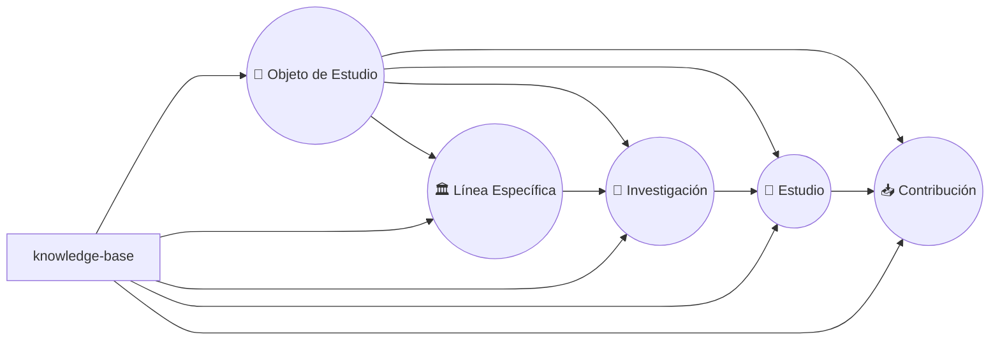

# 📚 Base de Conocimiento en `cognición`

Bienvenid@ a la **Base de Conocimiento** (`knowledge-base`) de `cognición`.  
Aquí se organizan, documentan y trazan **todos los nodos de conocimiento** desarrollados bajo este marco metodológico, es el ámbito general o repositorio donde se organizan todos los nodos resultantes del proceso de `cognición`. Cada subcarpeta representa un conjunto de nodos del mismo tipo (contribución, estudio, etc.), creados a partir de las **herramientas cognitivas**, las cuales pueden ser usadas para avanzar en el proceso (creando nodos), cada herramienta aporta mayor precisión y calidad en el conocimiento y entendimiento de un **[objeto de estudio 🧠][OET]**.

---

## 📑 Índice

- [🔍 Conceptos Clave](#-conceptos-clave)
- [🧩 ¿Qué Encontrarás Aquí?](#-qué-encontrarás-aquí)
- [📑 Índice General de Objetos de Estudio](#-índice-general-de-objetos-de-estudio)
- [📦 Estructura Recomendada](#-estructura-recomendada)
- [🗂️ Principios de Organización](#️-principios-de-organización)
- [📝 ¿Cómo Contribuir?](#-cómo-contribuir)
- [🗃️ Recursos Adicionales](#️-recursos-adicionales)

<!-- Enlaces de interés -->

[INDEX]: #-índice
[COGNI]: ../README.md 'cognición'
[LCCBYSA]: ../LICENSE-CC-BY-SA.md 'Licencia CC BY SA'
[LGPL]: ../LICENSE-GPLv3.md 'Licencia GPLv3'
[DOCS]: ../docs/README.md 'Documentación extendida'
[OET]: ../docs/foundations/object-study.md 'Teoría del objeto de estudio'
[CTAIA]: ../docs/ai-assistant-configuration-guide.md 'Configuración de IA'
[CONTRIB]: ../CONTRIBUTING.md 'Cómo Contribuir'
[PTT]: ../templates/README.md 'Plantillas de trabajo'
[RESEARCHERS]: ../researchers/README.md 'Investigadores'
[AUT]: ../scripts/README.md 'Automatización'
[ASAI]: ../ai-assistance/README.md 'Asistente de IA'
[GLOSSG]: ./glossary.md 'Glosario General'

<!-- ================= -->

<!-- Objetos de Estudio -->

[OE1]: ./objects/3ad176e9-c47e-47b4-9f0b-cc55092cdb88/object-study.md

<!-- ================= -->

<!-- Conceptos clave (tags) -->

[COGNICION]: ./glossary.md#cognición
[TRAZABILIDAD]: ./glossary.md#trazabilidad
[TEORIA]: ./glossary.md#teoría
[COLABORAR]: ./glossary.md#colaborar
[RIGOR]: ./glossary.md#rigor
[EPISTEMOLOGIA]: ./glossary.md#epistemología
[PRECISION]: ./glossary.md#precisión
[MODULAR]: ./glossary.md#modular
[REUTILIZABLE]: ./glossary.md#reutilizable
[INTERCONECTADO]: ./glossary.md#interconectado-da
[VERIFICABLE]: ./glossary.md#verificable
[EXTENSIBLE]: ./glossary.md#extensible
[AUTONOMIA]: ./glossary.md#autonomía
[INTEROPERABILIDAD]: ./glossary.md#interoperabilidad
[NODO]: ./glossary.md#nodo
[REPOSITORIO]: ./glossary.md#repositorio

<!-- ================= -->

💡 **Enlaces de interés:**  
🔗 [`cognición`][COGNI] | [Documentación][DOCS] | [Cómo contribuir][CONTRIB] | [Investigadores][RESEARCHERS] | [Asistente IA][ASAI]

---

## 🔍 Conceptos Clave

_[`cognición`][COGNICION]_, _[`trazabilidad`][TRAZABILIDAD]_, _[`teoría`][TEORIA]_, _[`colaborar`][COLABORAR]_, _[`rigor`][RIGOR]_, _[`epistemología`][EPISTEMOLOGIA]_, _[`precisión`][PRECISION]_, _[`modular`][MODULAR]_, _[`reutilizable`][REUTILIZABLE]_, _[`interconectado`][INTERCONECTADO]_, _[`verificable`][VERIFICABLE]_, _[`extensible`][EXTENSIBLE]_, _[`autonomía`][AUTONOMIA]_, _[`interoperabilidad`][INTEROPERABILIDAD]_, _[`nodo`][NODO]_, _[`nodo`][NODO]_, _[`repositorio`][REPOSITORIO]_.

💡 **Enlaces de interés:**  
🔗 [`cognición`][COGNI] | [Documentación][DOCS] | [Cómo contribuir][CONTRIB] | [Investigadores][RESEARCHERS] | [Asistente IA][ASAI] | _[Índice][INDEX]_

---

## 🧩 ¿Qué Encontrarás Aquí?

- **Nodos de Conocimiento:**  
  Cada carpeta principal corresponde a un **nodo de conocimiento** creado a partir de las plantillas de trabajo que representan **herramientas cognitivas** (contribuciones, estudios, etc).
- Dentro de cada nodo se encuentran:
  - **Objetos de estudio.**
  - **Líneas de investigación.**
  - **Investigaciones.**
  - **Estudios.**
  - **Contribuciones**
  - **Análisis críticos.**
  - **Conclusiones integrales.**
  - **Validación de rigurosidad y calidad.**
- **Herramientas cognitivas y estructura común:**
  Todos los nodos siguen la estructura y plantillas definidas por `cognición`, lo que facilita la trazabilidad, comparación y calidad de las contribuciones.

💡 **Enlaces de interés:**  
🔗 [`cognición`][COGNI] | [Documentación][DOCS] | [Cómo contribuir][CONTRIB] | [Investigadores][RESEARCHERS] | [Asistente IA][ASAI] | _[Índice][INDEX]_

---

## 📑 Índice General de Objetos de Estudio

> 💡 _Aquí se encuentra cada nuevo objeto de estudio creado usando las herramientas cognitivas._

| Objeto de Estudio      | Descripción breve                              | Estado        | Última actualización |
| ---------------------- | ---------------------------------------------- | ------------- | -------------------- |
| [El conocimiento][OE1] | _`Estudio de la naturaleza del conocimiento.`_ | ⚫ `Borrador` | `2025-06-26`         |
| ...                    | ...                                            | ...           | ...                  |

💡 **Enlaces de interés:**  
🔗 [`cognición`][COGNI] | [Documentación][DOCS] | [Cómo contribuir][CONTRIB] | [Investigadores][RESEARCHERS] | [Asistente IA][ASAI] | _[Índice][INDEX]_

---

## 📦 Estructura Recomendada

```text
knowledge-base/
├── README.md                # Guía de conocimiento base y de navegación de los objetos de estudio.
├── glossary.md              # Glosario transversal de conceptos clave usados en todo el repositorio.
├── objects/                      # Repositorio de nodos de objetos de estudio.
│   └── [uuid-objeto-estudio]/           # Nodo Objeto de Estudio específico (ej., El Conocimiento/), el nombre de la carpeta es el UUID que se le asigno al objeto.
│       ├── [nombre-objeto-estudio].md   # Documento estructural del objeto (ej. el-conocimiento): definición, propiedades, rol.
│       ├── metadata.yaml                # Metadatos técnicos, estado, UUID, fechas clave, responsable, etc.
│       └── glossary.md                  # Glosario local con términos particulares del objeto.
├── lines/                        # Repositorio de de nodos de líneas de investigación.
│   └── [uuid-linea-investigación]/             # Nodo línea de investigación (enfoque epistemológico adoptado para explorar el objeto).
│       ├── [título-línea-investigación].md     # Marco teórico y metodológico de la línea de investigación.
│       └── metadata.yaml                       # Metadatos de la línea: enfoque, paradigma, responsable, etc.
├── researches/                   # Repositorio de nodos de proyectos de investigación.
│   └── [uuid-investigación]/            # Nodo de Proyecto concreto con objetivos delimitados.
│       ├── [título-investigación].md    # Documento que presenta la justificación, objetivos y metodología.
│       └── metadata.yaml                # Metadatos específicos de esta investigación.
├── studies/                      # Repositorio de nodos de estudios aplicados (desarrollados en el marco de una investigación).
│   └── [uuid-estudio]/                  # Nodo de estudio específico (análisis, observación, etc.).
│       ├── [título-estudio].md          # Detalles técnicos del estudio (diseño, muestra, hallazgos).
│       └── metadata.yaml                # Metadatos del estudio (autor, fechas, técnica).
├── contributions/                # Repositorio de nodos de aportaciones (productos cognitivos).
│   └── [uuid-contribución]/             # Nodo de contribución individual.
│       └── [título-contribución].md     # Contenido completo de la contribución.
├── validations/                  # Repositorio de nodos de validaciones realizadas.
│   └── [uuid-validación]/               # Nodo de una validación específica.
│       └── [título-validación].md/      # Informe de validación.
├── conclusions/                  # Repositorio de nodos de conclusiones.
│   └── [uuid-conclusion]/               # Nodo de conclusión específica.
│       └── [título-conclusión].md/      # Texto argumentativo final.
├── analysis/                     # Repositorio de nodos de análisis crítico.
│   └── [uuid-análisis]/                 # Nodo de análisis específico.
│       └── [título-análisis].md         # Desarrollo del análisis.
├── assets/                       # Repositorio de nodos de evidencia y otros elementos de apoyo (gráficos, datasets, imágenes, videos).
│   └── [uuid-referencia]                # La carpeta perteneciente a cualquier herramienta cognitiva (objeto, línea, estudio, etc) y el uuid de dicha herramienta.
│       ├── ...                          # La evidencia. Se puede adoptar cualquier tipo de estructura.
│       ├── ...
│       └── ...
└──
```

> 📝 **Nota**: _La organización no es neutra: refleja una estructura modular cuyo objetivo es, permitir la evolución de cada herramienta cognitiva de manera individual; cada **[nodo][NODO]**, refleja un posicionamiento [teórico][TEORIA] sobre cómo se construye el conocimiento._

### 🧬 Estructura Semántica



💡 **Enlaces de interés:**  
🔗 [`cognición`][COGNI] | [Documentación][DOCS] | [Cómo contribuir][CONTRIB] | [Investigadores][RESEARCHERS] | [Asistente IA][ASAI] | _[Índice][INDEX]_

---

## 🗂️ Principios de Organización

- **🔍 Trazabilidad:**
  Cada avance, contribución o modificación queda registrada en la estructura del repositorio y/o en el historial de Git. Esto permite identificar el origen, autoría, propósito y evolución de cada elemento de investigación.
- **🤝 Colaboración:**
  La documentación clara, modular y semántica permite que cualquier miembro del equipo (humano o asistente IA) pueda comprender, auditar o continuar un proceso sin ambigüedad.
- **🎯 Rigurosidad:**
  La estructura se basa en plantillas, glosarios y metadatos coherentes con estándares de calidad metodológica y principios epistémicos definidos en `cognición`.
- **🧠 Precisión Epistémica:**
  Toda la estructura está alineada con una visión del conocimiento como proceso dinámico, evolutivo y refinable, lo que implica que incluso los documentos pueden modificarse, criticarse o refinarse en ciclos sucesivos sin perder su trazabilidad ni su identidad.
- **♻️ Modularidad Reutilizable:**
  Cada nivel (objeto, línea, investigación, estudio, contribución) es autónomo pero interoperable, lo que permite:
  - Reutilizar marcos teóricos, metodologías o análisis en nuevos contextos.
  - Compartir bloques de conocimiento entre proyectos sin duplicación.
- **🧩 Interconectividad:**
  El conocimiento no se almacena de forma lineal, sino en red. Las relaciones entre objetos, líneas o contribuciones son parte explícita de la documentación, lo que permite construir mapas epistémicos y realizar navegación semántica.
- **🧪 Verificabilidad:**
  Cada contribución está diseñada para ser validada explícitamente. Las carpetas de **validaciones** (`validations/`), **conclusiones** (`conclusions/`), **análisis** (`analysis/`) y **activos** (`assets/`) no son adornos, sino manifestaciones estructurales del principio científico de revisión crítica.
- **🏗️ Extensibilidad:**
  La estructura permite escalar desde una exploración individual hasta un repositorio de investigación colaborativa con múltiples líneas simultáneas, sin perder orden ni claridad.
- **💡 Inteligencia asistida:**
  El diseño anticipa y habilita la integración de asistentes de IA:
  - Para sugerencias automatizadas.
  - Para validación sintáctica o epistémica.
  - Para generación de commits, versiones y relaciones.

> 📝 **Nota**: _Estos principios aseguran que la estructura no solo sea ordenada, sino que represente el conocimiento como proceso dinámico, evolutivo y refinable._

💡 **Enlaces de interés:**  
🔗 [`cognición`][COGNI] | [Documentación][DOCS] | [Cómo contribuir][CONTRIB] | [Investigadores][RESEARCHERS] | [Asistente IA][ASAI] | _[Índice][INDEX]_

---

## 📝 ¿Cómo Contribuir?

| Paso                                 | 🤖 Asistente IA Web (ChatGPT - GitHub Copilot)                                              | 💻 IDE Local     | 🌐 GitHub Web    | 🗂️ GitHub Pages  |
| ------------------------------------ | ------------------------------------------------------------------------------------------- | ---------------- | ---------------- | ---------------- |
| 1. **Crear objeto de estudio**       | Usa `(crear-objeto)`                                                                        | En desarrollo... | En desarrollo... | En desarrollo... |
| 2. **Crear líneas de investigación** | Usa `(crear-línea-investigación)`                                                           | En desarrollo... | En desarrollo... | En desarrollo... |
| 3. **Crear Investigaciones**         | Usa `(crear-investigación)`                                                                 | En desarrollo... | En desarrollo... | En desarrollo... |
| 4. **Crear Estudio**                 | Usa `(crear-estudio)`                                                                       | En desarrollo... | En desarrollo... | En desarrollo... |
| 5 **Documentar contribuciones**      | Usa `(crear-contribución)`                                                                  | En desarrollo... | En desarrollo... | En desarrollo... |
| 6. **Validar o comentar aportes**    | Usa `(validar-contribución)` o `(analizar-contribución)` o `(conclusiones-de-contribución)` | En desarrollo... | En desarrollo... | En desarrollo... |

> 📝 **Nota**: _¿Tienes dudas o deseas agregar un nuevo objeto de estudio?  
> Consulta la guía rápida en el README principal del proyecto o solicita asistencia con los prompts disponibles._

💡 **Enlaces de interés:**  
🔗 [`cognición`][COGNI] | [Documentación][DOCS] | [Cómo contribuir][CONTRIB] | [Investigadores][RESEARCHERS] | [Asistente IA][ASAI] | _[Índice][INDEX]_

---

## 🗃️ Recursos Adicionales

- [`cognición`][COGNI]
- [Glosario general][GLOSSG]
- [Plantillas oficiales de trabajo][PTT]
- [Investigadores][RESEARCHERS]
- [Automatización][AUT]
- Licencias
  - [CC BY-SA 4.0][LCCBYSA]
  - [GPLv3][LGPL]

💡 **Enlaces de interés:**  
🔗 [`cognición`][COGNI] | [Documentación][DOCS] | [Cómo contribuir][CONTRIB] | [Investigadores][RESEARCHERS] | [Asistente IA][ASAI] | _[Índice][INDEX]_

---
