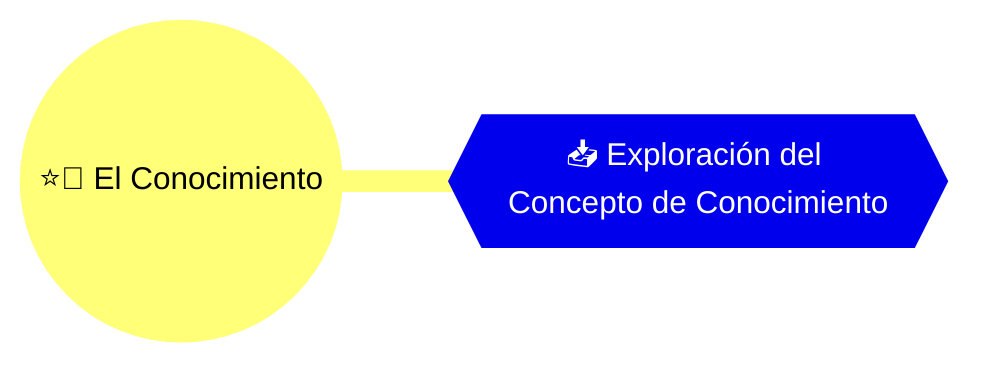
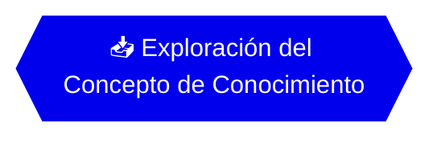

# 📥 Exploración del Concepto de Conocimiento

**_--Un análisis desde la perspectiva de tres modelos del conocimiento--_**

## 👤 Autor Principal: [José de Jesús Fuentes Galindo][RESEARCHER1]

> _Esta contribución tiene como objetivo analizar la naturaleza del conocimiento desde la perspectiva de tres modelos: el mecanicista, el idealista-subjetivo y el objetivo-activista. Se busca responder a la pregunta central de **¿qué es el conocimiento?**_

- **🧠 Objeto de Estudio:** [`El Conocimiento`][OE]
- **🏛️ Línea de investigación:** [`---`][LI]
- **📙 Investigación:** [`---`][RES]
- **🔬 Estudio:** [`---`][STD]
- **🔤 Id:** `ed09e653-5c4d-45df-8c9e-ffa1964ee392`
- **⚫ Estatus:** `Borrador`
- **🔢 Versión:** `0.1.0`
- **🏷️ Última Confirmación (commit)**: `---`
- **🛤️ Rama Actual Git:** `main`
- **✅ Calidad de la Aportación:** `Sin evaluar`
- **📅 Fecha de Creación:** `2025-05-28`
- **📅 Fecha de Actualización:** `2025-07-02`
- **🏫 Fuente Principal:** `De Bachilleres, C. (2003). Métodos de investigación / Methods of Investigation: Compendio Fascicular/ Fascicle Compendium`
- **📄 Tipos de Fuente:** `Secundaria`, `Documental`
- **📄 Tipo de Conocimiento:** `Filosófico`
- **👥 Colaboradores:** `Sin Colaboradores`

> 📝 **Nota**: _Este documento detalla la contribución hecha al **Estudio** "[---][STD]", que es una unidad de trabajo que contribuye con información, análisis o pruebas a la **Investigación** "[---][RES]", la cual opera bajo la **Línea de Investigación** "[---][LI]", y enriquece la comprensión del **Objeto de Estudio** "[El Conocimiento][OE]"._

---

## 📑 Índice

- [🔍 Conceptos Clave](#-conceptos-clave)
- [📚 Marco Teórico de Referencia](#-marco-teórico-de-referencia)
- [🧭 Metodología Aplicada](#-metodología-aplicada)
- [📃 Desarrollo Detallado](#-desarrollo-detallado)
- [📎 Datos o Recursos Vinculados](#-datos-o-recursos-vinculados)
- [🔍 Análisis Crítico y Reflexión](#-análisis-crítico-y-reflexión)
- [💭 Conclusión Integral](#-conclusión-integral)
- [✅ Validación y Calidad](#-validación-y-calidad)
- [🧬 Enlace Semántico](#-enlace-semántico)
- [📚 Referencias y Fuentes](#-referencias-y-fuentes)

<!-- Enlaces de interés -->

[INDEX]: #-índice
[COGNI]: ../../../README.md 'cognición'
[INI]: ../../README.md 'Investigaciones'
[OE]: ../../objects/3ad176e9-c47e-47b4-9f0b-cc55092cdb88/object-study.md 'Objeto de estudio'
[LI]: line-research.md 'Línea de investigación'
[RES]: research.md 'Investigación'
[STD]: study.md 'Estudio'
[GLOSSG]: ../../glossary.md 'Glosario general'
[GLOSSOE]: ../../objects/3ad176e9-c47e-47b4-9f0b-cc55092cdb88/glossary.md 'Glosario del objeto de estudio'
[CONTEXT]: ../../objects/3ad176e9-c47e-47b4-9f0b-cc55092cdb88/object-study.md#-introducción 'Contexto del Estudio'

<!-- ================= -->

<!-- Enlaces semánticos -->

[EF1]: ../../objects/3ad176e9-c47e-47b4-9f0b-cc55092cdb88/object-study.md

<!-- ================= -->

<!-- Conceptos clave (tags) -->

[APRENDIZAJE]: ../../objects/3ad176e9-c47e-47b4-9f0b-cc55092cdb88/glossary.md#aprendizaje
[CONOCIMIENTO]: ../../glossary.md#conocimiento
[INDISOLUBLE]: ../../objects/3ad176e9-c47e-47b4-9f0b-cc55092cdb88/glossary.md#indisoluble
[ESTATICO]: ../../objects/3ad176e9-c47e-47b4-9f0b-cc55092cdb88/glossary.md#estático-ca
[AMBITO]: ../../objects/3ad176e9-c47e-47b4-9f0b-cc55092cdb88/glossary.md#ámbito
[PROCESO]: ../../glossary.md#proceso
[DINAMICO]: ../../glossary.md#dinámico-ca
[EVOLUCION]: ../../glossary.md#evolución
[METODO]: ../../glossary.md#método
[CARACTERISTICA]: ../../glossary.md#característico-ca
[INTERCONECTADO]: ../../glossary.md#interconectado-da

<!-- ================= -->

<!-- Investigadores -->

[RESEARCHER1]: ../../../researchers/README.md

<!-- ================= -->

💡 **Enlaces de interés:**  
🔗 [`cognición`][COGNI] | [Inicio][INI] | [Objeto de Estudio][OE] | [Línea Investigativa][LI] | [Investigación][RES] | [Estudio][STD]

---

## 🔍 Conceptos Clave

_[`aprendizaje`][APRENDIZAJE]_, _[`conocimiento`][CONOCIMIENTO]_, _[`indisoluble`][INDISOLUBLE]_, _[`estático`][ESTATICO]_, _[`ámbito`][AMBITO]_, _[`proceso`][PROCESO]_, _[`dinámico`][DINAMICO]_, _[`evolución`][EVOLUCION]_, _[`método`][METODO]_, _[`característica`][CARACTERISTICA]_, _[`interconectado`][INTERCONECTADO]_

💡 **Enlaces de interés:**  
🔗 [`cognición`][COGNI] | [Inicio][INI] | [Objeto de Estudio][OE] | [Línea Investigativa][LI] | [Investigación][RES] | [Estudio][STD] | [Glosario general][GLOSSG] | [Glosario del objeto][GLOSSOE] | _[Índice][INDEX]_

---

## 📚 Marco Teórico de Referencia

> 💡 _Aquí se proporciona una visión general de la contribución, lista los enfoques, autores, corrientes, o teorías existentes, que fundamentan su contenido._

Para comprender cómo se conceptualiza y explica el conocimiento, es vital revisar los modelos epistemológicos y explicativos existentes, que ofrecen estructuras teóricas para interpretar fenómenos cognitivos y semánticos.

### Corrientes Epistemológicas

- **Objetivo-activista** (Jean Piaget)  
  → Considera el conocimiento como una construcción activa del sujeto en interacción con el objeto, y el contexto que determina el significado del objeto y las acciones del sujeto sobre el objeto.
- **Mecanicista** (John Locke)
  → Fundamenta el conocimiento en la experiencia sensorial y la observación directa.
- **Idealista-subjetivo** (George Berkeley)
  → Considera que el conocimiento surge cuando el sujeto interpreta al objeto desde su propia perspectiva, influida por su contexto interno (emociones, intereses, ideologías); así, el objeto adquiere sentido al ser pensado por el sujeto.

> 📝 **Nota:** Este marco teórico es dinámico y se refinará en futuras iteraciones, si es necesario. El refinamiento depende del **análisis crítico**, las **conclusiones integrales** y las **validaciones** que se llevan a cabo sobre la contribución.

💡 **Enlaces de interés:**  
🔗 [`cognición`][COGNI] | [Inicio][INI] | [Objeto de Estudio][OE] | [Línea Investigativa][LI] | [Investigación][RES] | [Estudio][STD] | _[Índice][INDEX]_

---

## 🧭 Metodología Aplicada

> 💡 _Descripción específica del método utilizado para llevar a cabo esta contribución (ej., revisión documental, entrevista, análisis estadístico, experimento, simulación, desarrollo de modelo)._

El estudio se basa en un análisis documental y conceptual de las teorías del conocimiento, específicamente a través de la revisión de fuentes teóricas especializadas que abordan los modelos mecanicista, idealista-subjetivo y objetivo-activista. Se busca comprender cómo cada modelo explica la relación entre el sujeto, el objeto y la sociedad en el proceso de conocimiento.

### 📝 Diseño Metodológico y Enfoque

> 💡 _Detalla el tipo de diseño (ej., caso de estudio, cuasi-experimental, longitudinal) y el enfoque general (cualitativo, cuantitativo, mixto) específico de este estudio._

- **Enfoque:** _Teórico-comparativo_
- **Diseño del Estudio:** _**Diseño exploratorio-documental**, centrado en la revisión, comparación y análisis crítico de fuentes teóricas para construir una definición operativa y multidimensional del conocimiento como objeto de estudio._

### 🛠️ Técnicas e Instrumentos

> 💡 _Lista las técnicas de recolección y análisis de datos, así como las herramientas o instrumentos específicos empleados._

| Técnica utilizada          | Descripción                                                                                                |
| -------------------------- | ---------------------------------------------------------------------------------------------------------- |
| Tipo de estudio            | Análisis de contenido conceptual, comparación teórica.                                                     |
| Método de recolección      | Análisis documental.                                                                                       |
| Herramientas empleadas     | Fuentes teóricas especializadas (libros, artículos académicos, tratados epistemológicos).                  |
| Población/Muestra          | No aplica (fuentes seleccionadas por relevancia, diversidad epistemológica y rigurosidad).                 |
| Limitaciones metodológicas | Posible sesgo en la selección de fuentes, dependencia de la interpretación del investigador.               |
| ...                        | ...                                                                                                        |

### 📒 Procedimiento

> 💡 _Si aplica, explica paso a paso cómo se recolectaron los datos, incluyendo la secuencia de eventos, las instrucciones dadas a los participantes y cualquier control experimental implementado._

**No aplica.**

### 📊 Análisis de Datos

> 💡 _En estudios cualitativos detalla las técnicas de análisis (por ejemplo, codificación, análisis temático, análisis de contenido). En estudios teóricos explica cómo se construyó y analizó el marco conceptual._

El análisis se centra en la comparación y síntesis de las teorías del conocimiento, identificando similitudes y diferencias entre los modelos mecanicista, idealista-subjetivo y objetivo-activista. Se busca construir una definición operativa del conocimiento que contemple sus dimensiones teóricas y prácticas.

💡 **Enlaces de interés:**  
🔗 [`cognición`][COGNI] | [Inicio][INI] | [Objeto de Estudio][OE] | [Línea Investigativa][LI] | [Investigación][RES] | [Estudio][STD] | _[Índice][INDEX]_

---

## 📃 Desarrollo Detallado

> 💡 _Este espacio está destinado a la exposición completa de toda la información, análisis, resultados y argumentos que conforman el núcleo de esta contribución. El investigador tiene total libertad para estructurar este contenido de la manera que considere más adecuada, utilizando títulos, subtítulos, listas, tablas, gráficos o cualquier otro formato Markdown necesario para presentar su trabajo de forma clara y exhaustiva._

- **Contexto:** [`El Conocimiento`][CONTEXT]
- **Fecha de Creación del Contenido:** `2025-05-28`
- **Última Actualización del Contenido:** `2025-06-24`

### EL CONOCIMIENTO

El aprendizaje como habilidad fundamental para producir conocimiento y así transformar el entorno social de un sujeto, característica humana que lo distingue.

> _"(...) el conocimiento es un proceso continuo, en donde intervienen y participan el sujeto (persona), objeto y el entorno social-histórico."_

Se aborda el estudio del conocimiento desde la perspectiva de que es un proceso de interacción sujeto-objeto-sociedad, que se desarrolla a través de la acción del sujeto sobre el objeto en un contexto social determinado. Este proceso no es estático, sino dinámico y en constante evolución. Su interrelación comprende características y métodos con los cuales cada uno explica la realidad.

Esto permite explicar y comprender el conocimiento y su evolución a través del tiempo, permite ampliar tu visión respecto a como se organiza en distintos ámbitos de la vida cotidiana y del campo del saber.

Desde la infancia aprendemos a conocer el mundo que nos rodea, cambiando tu visión de las cosas y de la gente conforme pasaba el tiempo, y a medida que te relacionabas con los demás.

Los autores de la referencia bibliográfica, _De Bachilleres, C. (2003). Metodos de investigacion / Methods of Investigation: Compendio Fascicular/ Fascicle Compendium_, abordan el conocimiento mediante la explicación de tres modelos que representan la relación sujeto-objeto-sociedad que se establece mediante el proceso de conocer.

La explicación del proceso se llevará a cabo mediante tres modelos: el Mecanicista, Idealista-subjetivo y el Objetivo-activista. Cada una de estas explicaciones está expresada en "Modelos del conocimiento".

#### Modelo Mecanicista

Concibe el conocimiento como un proceso pasivo, donde el sujeto es un receptor de información del objeto, que se refleja objetivamente en su mente, gracias a la disposición del aparato perceptivo le permiten registrar los datos que provienen del objeto. Este modelo sostiene que el sujeto percibe la realidad externa de manera objetiva, sin influencias subjetivas.

> _"La mente humana, es como una hoja de papel en blanco, nada se ha escrito, los sentidos escriben sobre ella". John Locke_

#### Modelo idealista-subjetivo

El sujeto da sentido al objeto a través del pensamiento; lo describe a partir de su punto de vista, en donde intervienen intereses, emociones e ideologías, independientemente de las características del objeto.  
El objeto por su parte, aparece como existe al ser pensado por el sujeto y cobrar sentido.

> _"Algo es, existe si lo pienso; no es, no existe, si no lo pienso". George Berkeley_

#### Modelo objetivo-activista

El sujeto y el objeto no son entidades pasivas: su relación genera mutua transformación. El sujeto se relaciona con el objeto en condiciones sociales concretas, las cuales no solo posibilitan la interacción, sino que también otorgan significado tanto al objeto como a los datos que se derivan de él y las acciones del sujeto sobre el objeto. Aunque el objeto existe con independencia del sujeto, es a través de la interacción práctica que adquiere sentido para éste. La sociedad, en tanto mediadora y condicionante, enmarca esta relación dotándola de contenido histórico, simbólico y material.

Así, sujeto, objeto y sociedad conforman una unidad interconectada e indisoluble en la práctica, cuya interacción da lugar a un proceso vivo y dinámico de construcción de concepciones.

> _"Los tres elementos interactúan en la construcción del conocimiento". Piaget_

La creación de conocimiento a partir de la realidad exige la acción del sujeto sobre ella, ya sea en forma de manipulación física, observación empírica o reflexión intelectual. El conocimiento no es simplemente recibido: es elaborado activamente, y su contenido se acomoda en los esquemas previos del sujeto cognoscente, transformando tanto al sujeto como a su comprensión del objeto.

Desde esta perspectiva, el conocimiento es un proceso en constante construcción, donde interactúan sujeto, objeto y sociedad. Este proceso se desarrolla por medio de:

- La acción del sujeto,
- La significación del objeto,
- Y el acondicionamiento social que estructura ambos.

No puede atribuirse el origen del conocimiento a ninguno de estos elementos por separado; sólo su interacción lo hace posible. Por ello, el conocimiento no es un producto acabado ni estático, sino un proceso evolutivo, abierto y situado.

Las cualidades del objeto influyen en la actividad del sujeto, condicionando las formas en que puede ser comprendido, utilizado o transformado. Esta transformación puede orientarse hacia la satisfacción individual o al bienestar colectivo, según las intenciones del sujeto y las necesidades sociales.

Al mismo tiempo, el contexto social ofrece un conjunto de mediaciones materiales, simbólicas e institucionales que moldean y posibilitan las elecciones del sujeto, configurando un marco dinámico para la producción del conocimiento.

> _"Que la atención del sujeto sea dirigida a ciertos objetos (o situaciones) y no a otros; que los objetos sean situados en ciertos contextos y no en otros; que las acciones sobre los objetos sean dirigidas en cierta forma y no en otras; todo esto está fuertemente influido por el medio social y cultural (...) pero todas estas condiciones no modifican los mecanismos que necesita esa especie biológica tan particular que es el ser humano para adquirir el conocimiento de dichos objetos, en sus respectivos contextos, en todas las significaciones particulares socialmente determinadas que ya le han sido asignadas" (Piaget, J. y Garcia R., Ciencia, Psicogénesis e ideología, p.245)._

💡 **Enlaces de interés:**  
🔗 [`cognición`][COGNI] | [Inicio][INI] | [Objeto de Estudio][OE] | [Línea Investigativa][LI] | [Investigación][RES] | [Estudio][STD] | _[Índice][INDEX]_

---

## 📎 Datos o Recursos Vinculados

> 💡 _Incluye enlaces a datasets, repositorios de código, modelos, archivos multimedia o cualquier otro recurso digital generado o utilizado en el estudio._

- [De Bachilleres Secretaría Académica; Coordinación de Administración Escolar y del Sistema Abierto, C. (2005). Métodos de investigación.][AM]

[AM]: https://repositorio.cbachilleres.edu.mx/wp-content/material/compendios/primero/met_inv_1.pdf

💡 **Enlaces de interés:**  
🔗 [`cognición`][COGNI] | [Inicio][INI] | [Objeto de Estudio][OE] | [Línea Investigativa][LI] | [Investigación][RES] | [Estudio][STD] | _[Índice][INDEX]_

---

## 🔍 Análisis Crítico y Reflexión

> 💡 _Espacio para que el(los) autor(es) de la contribución cierren de forma crítica y reflexiva, identificando vacíos conceptuales, posibles distorsiones, implicaciones y mejoras, a la vez que dejan abierta la posibilidad de expansión futura._

- [José de Jesús Fuentes Galindo](./analysis/279a7fdd-1bbe-4bf0-adbf-46479737f870/analysis.md)

💡 **Enlaces de interés:**  
🔗 [`cognición`][COGNI] | [Inicio][INI] | [Objeto de Estudio][OE] | [Línea Investigativa][LI] | [Investigación][RES] | [Estudio][STD] | _[Índice][INDEX]_

---

## 💭 Conclusión Integral

> 💡 _Espacio para una conclusión integral de esta contribución al estudio, conectando la pregunta inicial, el desarrollo, los hallazgos y las implicaciones con el estudio. Aquí se establece la pertinencia y el valor de la aportación de esta contribución._

- [José de Jesús Fuentes Galindo](./conclusions/feca1dfa-1250-49a0-9f98-5aa3f03c27d8/conclusion.md)

💡 **Enlaces de interés:**  
🔗 [`cognición`][COGNI] | [Inicio][INI] | [Objeto de Estudio][OE] | [Línea Investigativa][LI] | [Investigación][RES] | [Estudio][STD] | _[Índice][INDEX]_

---

## ✅ Validación y Calidad

> 💡 _Esta sección evalúa el rigor y la confiabilidad de **esta contribución específica**, basándose en su metodología, resultados y el proceso de revisión._

### 🛡️ Proceso de Evaluación

| Tipos de evaluación | Evaluador | Puntaje Total |
| ------------------- | --------- | ------------- |
| ...                 | ...       | ...           |

[VAL1]: ./validations/63263bec-e774-4898-9a03-c44f1a9d55b7/validation.md

### 🧮 Evaluación de Calidad Detallada

> 💡 _Se muestra la evaluación de calidad y rigurosidad respecto a esta contribución; y cómo se alinea con los estándares del estudio, de la investigación principal y la línea investigativa._

| **Categoría**              | **Criterios Evaluados**                                                                        | **Puntaje (1-5)** |
| :------------------------- | :--------------------------------------------------------------------------------------------- | :---------------- |
| Relevancia y Claridad      | Responde a la pregunta/proposición del estudio, justificación, pertinencia de la contribución. | 0                 |
| Metodología Aplicada       | Coherencia del método, adecuación de técnicas, manejo de limitaciones.                         | 0                 |
| Desarrollo y Hallazgos     | Evidencia presentada, rigor del análisis, claridad de los resultados.                          | 0                 |
| Conclusión y Reflexión     | Validez de las conclusiones, profundidad del análisis crítico, implicaciones.                  | 0                 |
| Integridad y Trazabilidad  | Referenciación adecuada, vinculación a recursos externos, control de versiones.                | 0                 |

**Puntaje Total:** 0  
**Calidad General:** _Sin evaluar_

> 📝 **Nota**: _Esta evaluación considera factores clave, cada uno puntuado en una escala de **1 (deficiente) a 5 (excelente)**._

💡 **Enlaces de interés:**  
🔗 [`cognición`][COGNI] | [Inicio][INI] | [Objeto de Estudio][OE] | [Línea Investigativa][LI] | [Investigación][RES] | [Estudio][STD] | _[Índice][INDEX]_

---

## 🧬 Enlace Semántico

> 💡 _Esta sección muestra los enlaces fundamentales y secundarios de esta contribución con otros **nodos de conocimiento** (contribuciones, estudios, investigaciones, líneas de investigación, objetos de estudio). Es fundamental para mapear el flujo de conocimiento._

### 🔁 Enlaces Fundamentales

> 💡 _Esta sección muestra los enlaces directos, a los **nodos de conocimiento** específicos, que se derivan del estudio de **El Conocimiento**. Se actualizan conforme se agregan nuevos enlaces desde o hacia esta contribución._

| Tipo de Nodo      | Título                   | Descripción                                 | Tipo de Enlace      | Importancia  (⭐/📑/🔍/💡/📚)                      |
| ----------------- | ------------------------ | ------------------------------------------- | ------------------- | ------------------------------------------------------ |
| Objeto de Estudio | [`El Conocimiento`][EF1] | `Estudio de la naturaleza del conocimiento` | Eje de contribución | ⭐ **Clave**: Marco para la generación de conocimiento |
| ...               | ...                      | ...                                         | ...                 | ...                                                    |

**Esquema de enlaces fundamentales**

### 🔀 Enlaces Secundarios

> 💡 _Muestra los enlaces secundarios con otros **nodos de conocimiento** fuera del objeto de estudio, pero que tienen una relación semántica y epistemológica. Se actualiza conforme nuevos enlaces vayan surgiendo._

| Tipo de Nodo | Título | Descripción | Tipo de Enlace | Importancia  (⭐/📑/🔍/💡/📚) |
| ------------ | ------ | ----------- | -------------- | --------------------------------- |
| ...          | ...    | ...         | ...            | ...                               |

**Esquema de enlaces secundarios**

**Importancia:** Indica la importancia del enlace para el **objeto de estudio**:

- ⭐ **Clave:** → Fundamento esencial del objeto de estudio.
- 📑 **Soporte documental:** → Contiene información que apoya o fundamenta el tema principal.
- 🔍 **Soporte empírico:** → Contiene datos y evidencia.
- 💡 **Propuesta estratégica:** → Aporta ideas de acción.
- 📚 **Contexto educativo:** → Muestra aplicaciones específicas.

> 📝 **Nota:** Este **entrelazado de ideas** permite un análisis **multidimensional**, donde diferentes perspectivas contribuyen al debate.

💡 **Enlaces de interés:**  
🔗 [`cognición`][COGNI] | [Inicio][INI] | [Objeto de Estudio][OE] | [Línea Investigativa][LI] | [Investigación][RES] | [Estudio][STD] | _[Índice][INDEX]_

---

## 📚 Referencias y Fuentes

> 💡 _Listado de todas las fuentes bibliográficas y recursos específicos utilizados o citados en la contribución del **estudio**, con formato estándar (APA, IEEE, Chicago, Vancouver)._

| Fuente Principal                                                                                                                                  | Tipo de Fuente                | Relevancia para este Estudio                                 | Importancia para este Estudio  (⭐/📑/🔍/💡/📚)         |
| :------------------------------------------------------------------------------------------------------------------------------------------------ | :---------------------------- | :----------------------------------------------------------- | :---------------------------------------------------------- |
| De Bachilleres, C. (2003). Metodos de investigacion / Methods of Investigation: Compendio Fascicular/ Fascicle Compendium                         | `Secundaria`, `Documental`    | Abona fundamento teórico para la creación de concepciones.   | ⭐ **Clave:** Fundamento teórico.                           |
| ...                                                                                                                                               | ...                           | ...                                                          | ...                                                         |

**Importancia:** Indica la importancia de la fuente para este estudio específico:

- ⭐ **Clave:** → Fundamento esencial del estudio.
- 📑 **Soporte documental:** → Contiene información que apoya o fundamenta el tema principal.
- 🔍 **Soporte empírico:** → Contiene datos y evidencia.
- 💡 **Propuesta estratégica:** → Aporta ideas de acción o dirección.
- 📚 **Contexto educativo:** → Muestra aplicaciones específicas o ejemplos.

💡 **Enlaces de interés:**  
🔗 [`cognición`][COGNI] | [Inicio][INI] | [Objeto de Estudio][OE] | [Línea Investigativa][LI] | [Investigación][RES] | [Estudio][STD] | _[Índice][INDEX]_

---
