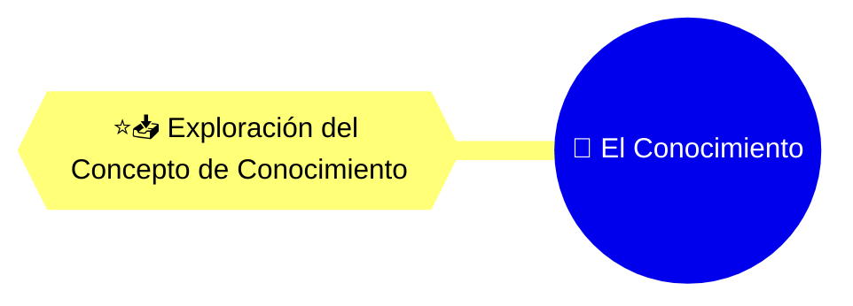
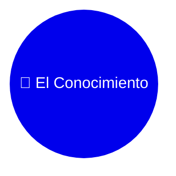

# 🧠 El Conocimiento

**_--Estudio de la naturaleza del conocimiento--_**

## 👤 Investigador Encargado: José de Jesús Fuentes Galindo

> _Estudio y Análisis integral de la naturaleza del conocimiento: **concepción, adquisición, distribución, almacenamiento, validación, aplicación y límites**. Considerando los **diferentes enfoques, metodologías y técnicas propias de cada paradigma**._

- **🔤 Id:** `3ad176e9-c47e-47b4-9f0b-cc55092cdb88`
- **⚫ Estatus:** `Borrador`
- **🔢 Versión:** `0.1.0`
- **🏷️ Última Confirmación (commit)**: `0bd50e3`
- **🛤️ Rama Actual Git:** `main`
- **📅 Fecha de Creación:** `2025-05-28`
- **📅 Última Actualización:** `2025-06-30`
- **📅 Última Contribución:** `2025-05-28`
- **📄 Tipos de Conocimiento:** `Filosófico`
- **👥 Colaboradores:** `Sin colaboradores`

> 📝 **Nota:** _Este documento organiza y sintetiza toda la información relacionada con **El Conocimiento**. Se nutre de los diferentes estudios y contribuciones realizadas por los investigadores._

---

## 📑 Índice

- [🔍 Conceptos Clave](#-conceptos-clave)
- [📌 Introducción](#-introducción)
- [📚 Marcos Teóricos de Referencia](#-marcos-teóricos-de-referencia)
- [📓 Definición Formal y Objetiva](#-definición-formal-y-objetiva)
- [🧬 Enlace Semántico](#-enlace-semántico)
- [🧭 Registro e Historial de Evolución](#-registro-e-historial-de-evolución)
- [✅ Validación y Calidad](#-validación-y-calidad)

<!-- Enlaces de interés -->

[INDEX]: #-índice 'Índice'
[COGNI]: ../../../README.md 'cognición'
[INI]: ../../README.md 'Inicio'
[RESEARCHERS]: ../../../researchers/README.md 'Investigadores'
[GLOSSG]: ../../glossary.md 'Glosario general'
[GLOSSOE]: ./glossary.md 'Glosario del objeto de estudio'

<!-- ================= -->

<!-- Enlaces semánticos -->

[EF1]: ../../contributions/ed09e653-5c4d-45df-8c9e-ffa1964ee392/contribution.md
[EF2]: LINK

<!-- ================= -->

<!-- Conceptos clave (tags) -->

[CONOCIMIENTO]: ../../glossary.md#conocimiento
[INTEGRAL]: ../../glossary.md#integral
[PARADIGMA]: ../../glossary.md#paradigma
[METODO]: ../../glossary.md#método
[ESTUDIO]: ../../glossary.md#estudio
[NITIDO]: ../../glossary.md#nítido-da
[FACTOR]: ../../glossary.md#factor-ra
[REFINAR]: ../../glossary.md#refinar
[NODO]: ../../glossary.md#nodo
[SEMANTICO]: ../../glossary.md#semántico-ca
[MUTABLE]: ./glossary.md#mutable

<!-- ================= -->

<!-- Investigadores -->

[RESERCHER1]: ../../../researchers/README.md

<!-- ================= -->

💡 **Enlaces de interés:**  
🔗 [`cognición`][COGNI] | [Inicio][INI] | [Investigadores][RESEARCHERS]

---

## 🔍 Conceptos Clave

_[`conocimiento`][CONOCIMIENTO]_, _[`integral`][INTEGRAL]_, _[`paradigma`][PARADIGMA]_, _[`método`][METODO]_, _[`estudio`][ESTUDIO]_, _[`nitido`][NITIDO]_, _[`factor`][FACTOR]_, _[`refinar`][REFINAR]_, _[`mutable`][MUTABLE]_, _[`nodo`][NODO]_, _[`semántico`][SEMANTICO]_.

💡 **Enlaces de interés:**  
🔗 [`cognición`][COGNI] | [Inicio][INI] | [Investigadores][RESEARCHERS] | [Glosario general][GLOSSG] | [Glosario del objeto][GLOSSOE] | _[Índice][INDEX]_

---

## 📌 Introducción

> 💡 _Aquí se incluye una introducción a **El Conocimiento**, su alcance y los objetivos principales de su estudio, así como las necesidades y preguntas que guían los estudios._

Debido a que el conocimiento es un factor de éxito, su estudio y análisis entonces adquiere una importancia suficientemente alta, como para tomarla en cuenta e integrarla como una habilidad de la vida cotidiana, ya que es un proceso presente a nivel biológico, emotivo e intelectual.

Dando como resultado que, el nivel de conocimiento que se posee, influye y en algunos casos determina nuestra relación con el contexto en el que nos desempeñamos. Entendiendo que el nivel de conocimiento está en función de la cantidad y calidad de datos obtenidos provenientes del contexto, que permiten reflejar de manera más nítida la realidad relacionada con él.

De esta manera, tener un entendimiento de los elementos que intervienen en el conocimiento, te permitirán refinar tu propio conocimiento, y así poder sostener un estado de equilibrio y adaptabilidad por mucho más tiempo.

### 🌎 Alcance

> 💡 _Muestra la delimitación, qué incluye y qué no incluye el objeto en esta etapa de comprensión. Esto ayuda a enfocar las primeras contribuciones y estudios._

Se busca comprender la naturaleza del conocimiento para interpretar con mayor claridad y profundidad el mundo que habitamos.

En esta primera iteración se pretende identificar los conceptos fundamentales que permitan definir y comprender con mayor claridad la naturaleza del conocimiento.

#### 🔍 Necesidades y preguntas que guían el estudio

> 💡 _Estos son los interrogantes más fundamentales que se buscan responder sobre la esencia del objeto, previos a cualquier enfoque particular._

Nuestra investigación surge de la imperante necesidad de explorar el conocimiento desde diversas perspectivas y paradigmas. Nos planteamos interrogantes clave para profundizar en su **naturaleza, adquisición, distribución, almacenamiento, validación, aplicación y límites**:

- ¿Qué es el conocimiento?
  - ¿Cómo podemos definirlo de forma integral?
- ¿Cómo se genera el conocimiento?
  - ¿Cuáles son los procesos inherentes a su creación?
- ¿Cómo se distribuye y almacena el conocimiento?
  - ¿Qué herramientas, métodos y técnicas existen?
- ¿Qué métodos de validación existen?
  - ¿Cómo aseguramos la fiabilidad y la verdad del conocimiento?
- ¿Qué modelos conceptuales describen el conocimiento?
  - ¿Cuáles son las estructuras que lo representan?
- ¿Qué metodologías de investigación son idóneas para su estudio?
  - ¿Cómo abordamos empíricamente el fenómeno del conocimiento?
- ¿Cómo podemos aplicar lo que conocemos?
  - ¿Qué herramientas tenemos a nuestra disposición?
- ¿Cuáles son los límites del conocimiento?
  - ¿Se puede conocer todo?

#### 🎯 Objetivos y resultados

> 💡 _Especifica que esperas obtener con el estudio de este objeto._

**Objetivos**:

- Alcanzar la rigurosidad y calidad necesarias para que el conocimiento derivado de este estudio sirva como fundamento para estudios futuros.
- Establecer bases epistemológicas robustas que sustenten una comprensión profunda del conocimiento.

**Resultados**:

- Una base epistemológica sólida y detallada que aporte sustento para estudios relacionados con el conocimiento en diversas disciplinas.

💡 **Enlaces de interés:**  
🔗 [`cognición`][COGNI] | [Inicio][INI] | [Investigadores][RESEARCHERS] | _[Índice][INDEX]_

---

## 📚 Marcos Teóricos de Referencia

> 💡 _Aquí se proporciona una visión general del objeto de estudio, lista los enfoques, autores, corrientes, o teorías existentes, que fundamentan su contenido._

### Corrientes Epistemológicas

- **Objetivo-activista** (Jean Piaget)  
  → Considera el conocimiento como una construcción activa del sujeto en interacción con el objeto, y el contexto que determina el significado del objeto y las acciones del sujeto sobre el objeto.
- **Mecanicista** (John Locke)
  → Fundamenta el conocimiento en la experiencia sensorial y la observación directa.
- **Idealista-subjetivo** (George Berkeley)
  → Considera que el conocimiento surge cuando el sujeto interpreta al objeto desde su propia perspectiva, influida por su contexto interno (emociones, intereses, ideologías); así, el objeto adquiere sentido al ser pensado por el sujeto.

> 📝 **Nota:** Este marco teórico es dinámico y se expandirá con el desarrollo de nuevos estudios. Cada enfoque puede ser retomado, ampliado o cuestionado desde perspectivas futuras.

💡 **Enlaces de interés:**  
🔗 [`cognición`][COGNI] | [Inicio][INI] | [Investigadores][RESEARCHERS] | _[Índice][INDEX]_

---

## 📓 Definición Formal y Objetiva

> 💡 _Ofrezca una definición inicial, concisa y lo más neutral posible, de lo que se entiende por el objeto de estudio._

El conocimiento es un proceso en el que intervienen diferentes factores, de los cuales, el objeto, el sujeto y el contexto, son los principales para poder entender como se lleva a cabo dicho proceso.

### 📄 Atributos Fundamentales

> 💡 _Aquí se lista las cualidades esenciales del objeto que se consideran universalmente verdaderas o inherentes a su existencia, independientemente de cómo se le mire._

- **Es un proceso.**
- **Es dinámico, evolutivo y refinable.**
- **Intervienen 3 elementos universales:** el sujeto, el objeto, el contexto (social, económico, etc).

### 🔛 Comportamientos Esenciales

> 💡 _Se describirían las formas primarias en que el objeto opera o interactúa._

- **Se adquiere.**
- **Se transmite.**
- **Se almacena.**
- **Se valida.**
- **Se aplica.**

> 📝 **Nota:** _Aunque la definición se busca objetivamente, los **estudios**, las **investigaciones** y las **líneas de investigación** serán las que exploren en profundidad esa esencia desde sus propios paradigmas. Es decir, si bien se busca una definición objetiva, las **herramientas cognitivas** anteriores son las que profundizan, interpretan, contextualizan o incluso desafían esa definición inicial, contribuyendo a su mutabilidad y refinamiento._

💡 **Enlaces de interés:**  
🔗 [`cognición`][COGNI] | [Inicio][INI] | [Investigadores][RESEARCHERS] | _[Índice][INDEX]_

---

## 🧬 Enlace Semántico

> 💡 _Esta sección muestra los enlaces fundamentales y secundarios de este objeto de estudio con otros **nodos de conocimiento** (contribuciones, estudios, investigaciones, líneas de investigación, objetos de estudio). Es fundamental para mapear el flujo de conocimiento._

### 🔁 Enlaces Fundamentales

> 💡 _Esta sección muestra los enlaces directos, a los **nodos de conocimiento** específicos, que se derivan del estudio de **El Conocimiento**. Se actualizan conforme se agregan nuevos nodos._

| Tipo de Nodo | Título                                            | Descripción                                                         | Tipo de Enlace | Importancia  (⭐/📑/🔍/💡/📚)       |
| ------------ | ------------------------------------------------- | ------------------------------------------------------------------- | -------------- | --------------------------------------- |
| Contribución | [`Exploración del Concepto de Conocimiento`][EF1] | `Un análisis desde la perspectiva de tres modelos del conocimiento` | Contribuye     | ⭐ **Clave**: Fundamento epistemológico |
| ...          | ...                                               | ...                                                                 | ...            | ...                                     |

**Esquema de enlaces fundamentales**

### 🔀 Enlaces Secundarios

> 💡 _Muestra los enlaces secundarios con otros **nodos de conocimiento** fuera del objeto de estudio, pero que tienen una relación semántica y epistemológica. Se actualiza conforme nuevos enlaces vayan surgiendo._

| Tipo de Nodo | Título | Descripción | Tipo de Enlace | Importancia  (⭐/📑/🔍/💡/📚) |
| ------------ | ------ | ----------- | -------------- | --------------------------------- |
| ...          | ...    | ...         | ...            | ...                               |

**Esquema de enlaces secundarios**

**Importancia:** Indica la importancia del enlace para el **objeto de estudio**:

- ⭐ **Clave:** → Fundamento esencial del objeto de estudio.
- 📑 **Soporte documental:** → Contiene información que apoya o fundamenta el tema principal.
- 🔍 **Soporte empírico:** → Contiene datos y evidencia.
- 💡 **Propuesta estratégica:** → Aporta ideas de acción.
- 📚 **Contexto educativo:** → Muestra aplicaciones específicas.

> 📝 **Nota:** Este **entrelazado de ideas** permite un análisis **multidimensional**, donde diferentes perspectivas contribuyen al debate.

💡 **Enlaces de interés:**  
🔗 [`cognición`][COGNI] | [Inicio][INI] | [Investigadores][RESEARCHERS] | _[Índice][INDEX]_

---

## 🧭 Registro e Historial de Evolución

> 💡 _Registra la evolución del conocimiento y entendimiento de este **objeto de estudio**._

### 🏛️ Líneas de Investigación

> 💡 _Muestra las líneas de investigación actuales y futuras de este **objeto de estudio**._

- [ ] `Sin líneas`.

### 📍 Nodos de Conocimiento

> 💡 _Muestra el historial de nodos construidos dentro de este **objeto de estudio**._

| Tipo         | Id                                   | Título                                          | Responsable                                 | Creación     | Última Actualización | Última Contribución | Estatus     | Notas                                |
| ------------ | ------------------------------------ | ----------------------------------------------- | ------------------------------------------- | ------------ | -------------------- | ------------------- | ----------- | ------------------------------------ |
| Contribución | ed09e653-5c4d-45df-8c9e-ffa1964ee392 | [Exploración del Concepto de Conocimiento][EF1] | [José de Jesús Fuentes Galindo][RESERCHER1] | `2025-05-28` | `2025-06-30`         | `---`               | ⚫ Borrador | Inicio del estudio del conocimiento. |

💡 **Enlaces de interés:**  
🔗 [`cognición`][COGNI] | [Inicio][INI] | [Investigadores][RESEARCHERS] | _[Índice][INDEX]_

---

## ✅ Validación y Calidad

> 💡 _Se muestra la evaluación global de calidad y rigurosidad respecto al estudio del **objeto de estudio**._

Evaluadores:

- `Sin evaluadores.`

### 🧮 Evaluación de Calidad

| **Categoría**                          | **Criterios Evaluados**                                           | **Puntaje (1-5)** |
| -------------------------------------- | ----------------------------------------------------------------- | ----------------- |
| Revisión y Fundamentación              | Fuentes confiables, variedad, actualidad                          | 0                 |
| Metodología                            | Claridad, adecuación, limitaciones                                | 0                 |
| Análisis y Desarrollo                  | Evidencias, análisis crítico, coherencia                          | 0                 |
| Impacto y Contribución                 | Innovación, impacto, líneas futuras                               | 0                 |
| Estructura y Organización              | Uso correcto de plantillas, claridad                              | 0                 |
| Coherencia y Consenso de la definición | La definición es ampliamente aceptada, es coherente y verificable | 0                 |

**Puntaje Total:** 0  
**Calidad General:** _Sin evaluación_

> 📝 **Nota**: Esta evaluación se realiza considerando cinco factores clave, cada uno puntuado en una escala de **1 (deficiente) a 5 (excelente)**.

💡 **Enlaces de interés:**  
🔗 [`cognición`][COGNI] | [Inicio][INI] | [Investigadores][RESEARCHERS] | _[Índice][INDEX]_

---
